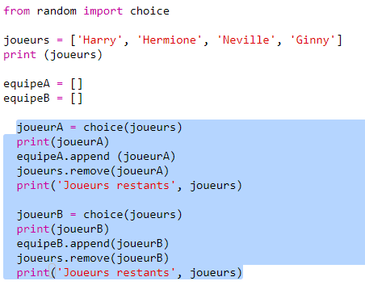
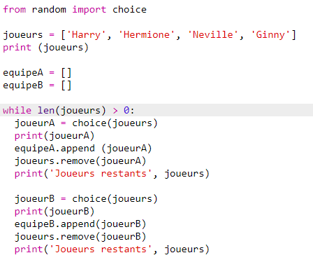
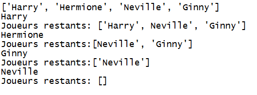
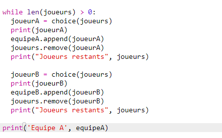
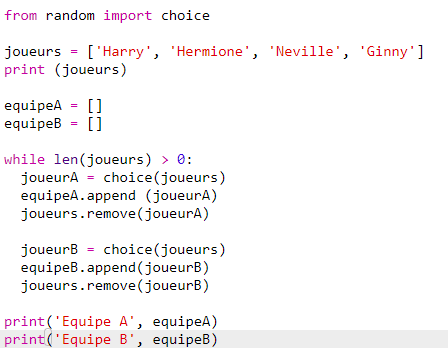
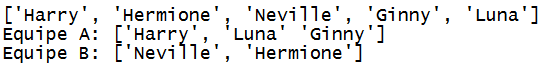

## Choisir plein de joueurs

Maintenant tu dois etre sur que chaque joueurs a été choisi pour une équipe.

+ Surligne ton code pour choisir les joueurs de l'équipe A et de l'équipe B et appuie sur la touche tab pour indenter ton code.

	

+ Ajouter une boucle __while__ pour continuer a choisir des joueurs jusqu'a ce que la longueur de la liste `players` soit égale a zéro.

	

+ Lance ton code pour le tester. Tu devrais voir les joueurs remplir les listes de l'équipe A et B jusqu'a ce qu'il n'y ai plus de joueurs.

	

+ Ajoute du code pour afficher ta liste `teamA` __après__ ta boucle `while` (vérifie que ce ne soit pas indenté)

	Cela veux dire que ton équipe `teamA` sera affiché une seule fois, après que les joueurs aient été choisis.

	

+ Tu peux faire la même chose pour `teamB`, et tu peux également supprimer les autres commande print, elles n'étaient utile que pour tester ton code.

	Voici ce a quoi ton code devrais ressembler

	

+ Test ton code une fois encore et tu devrais juste voir ta liste de joueurs ainsi et que tes équipes finales.

	

