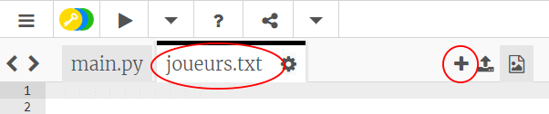
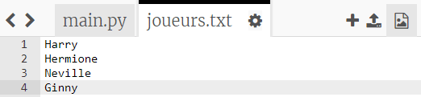
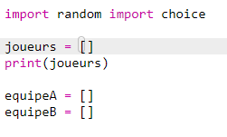
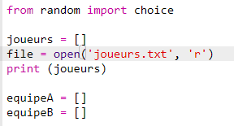
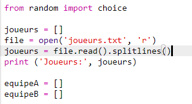

## Fichiers

Tu peux utiliser une variable pour stocker une liste de joueurs.

+ Clique sur l'icône + et crée un nouveau fichier nommé `joueurs.txt.` .
    
    

+ Ajoute tes joueurs à ton nouveau fichier. Assure-toi qu'il n'y a pas de ligne blanche après ton dernier joueur.
    
    

+ Change ta liste `joueurs` afin qu'elle soit vide.
    
    

+ Ouvre ton ficher `joueur.txt` (le `'r'` signifie en lecture seule).
    
    

+ Lire la liste à partir du fichier et ajouter à ta liste `joueurs`. (Le code `splitlines` signifie que chaque ligne dans le fichier est un nouvel élément dans la liste `joueurs` ).
    
    

+ Si tu testes ton code, il devrait fonctionner exactement comme avant. Cependant, il est maintenant beaucoup plus facile d'ajouter des joueurs à ton fichier `joueurs.txt`.