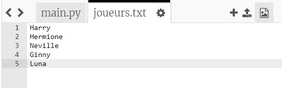
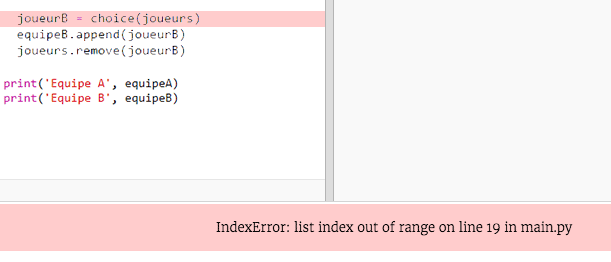
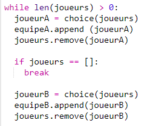
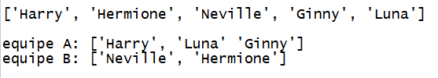

## Joueurs impair

Améliorons ton programme pour travailler avec un nombre impair de joueurs.

+ Ajoute un autre nom à ta liste `joueurs.txt`, de sorte que tu as un nombre impair de joueurs.
    
    

+ Si tu testes ton code, tu verras que tu obtiens un message d'erreur.
    
    

+ L'erreur est due au fait que ton programme continue de choisir des joueurs aléatoires pour l'équipe A, puis pour l'équipe B. Toutefois, s'il y a un nombre impair de joueurs, après avoir choisi un joueur pour l'équipe A, il ne reste plus aucun joueur à choisir pour l'équipe B.
    
    Pour corriger ce bug, tu peux indiquer à ton programme de `sortir` de ta boucle `while` si ta liste `joueurs` est vide.
    
    

+ Si tu testes à nouveau ton code, tu devrais voir qu'il fonctionne maintenant avec un nombre impair de joueurs.
    
    