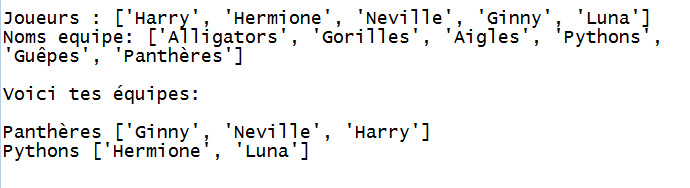

--- challenge ---

## Défi: Noms d'équipe aléatoire

Peux-tu donner un nom d'équipe aléatoire à tes deux équipes?

Tu peux créer une liste appelée `Nomsequipe` contenant les noms à choisir.

Tu peux ensuite choisir (et afficher) un nom aléatoire pour chaque équipe.

--- /challenge ---