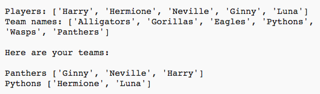

## भूमिका: 
इस प्रोजेक्ट में, आप खिलाड़ियों की सूची में से 2 बेतरतीब टीमें बनाना सीखेंगे।

  <iframe src="https://trinket.io/embed/python/a699c44ce6?outputOnly=true&start=result" width="600" height="500" frameborder="0" marginwidth="0" marginheight="0" allowfullscreen>
  </iframe>
  

### क्लब लीडर्स के लिए अतिरिक्त जानकारी

यदि आप इस प्रोजेक्ट को प्रिंट करना चाहते हैं, तो कृपया [प्रिंटर के लिए अनुकूल संस्करण](https://projects.raspberrypi.org/en/projects/team-chooser/print) का उपयोग करें।

--- collapse ---
---
title: क्लब लीडर के नोट्स
---

## भूमिका:
इस प्रोजेक्ट में, बच्चे खिलाड़ियों को 2 बेतरतीब टीमों में विभाजित करने के लिए प्रोग्राम बनाना सीखेंगे। यह प्रोजेक्ट सूचियों और फाइलों का उपयोग करना सीखाता है।

## ऑनलाइन संसाधन

__यह प्रोजेक्ट Python 3 का उपयोग करता है।__ हम Python ऑनलाइन लिखने के लिए [trinket](https://trinket.io/) का उपयोग करने की अनुशंसा करते हैं। इस प्रोजेक्ट में निम्नलिखित Trinkets शामिल होते हैं:

+ [नया (खाली) Python ट्रिंकेट -- jumpto.cc/python-new](http://jumpto.cc/python-new)

ऐसा भी ट्रिंकेट है, जिसमें पूर्ण प्रोजेक्ट शामिल होता है:

+ [‘टीम चयनकर्ता’ पूर्ण -- trinket.io/python/a699c44ce6](https://trinket.io/python/a699c44ce6)

## ऑफ़लाइन संसाधन
इस प्रोजेक्ट को [ऑफ़लाइन पूरा किया जा सकता है](https://www.codeclubprojects.org/en-GB/resources/python-working-offline/) यदि वरीय हो। आप इस प्रोजेक्ट के लिए 'प्रोजेक्ट सामग्री' लिंक पर क्लिक करके प्रोजेक्ट के संसाधनों तक पहुँच कर सकते हैं। इस लिंक में 'प्रोजेक्ट संसाधन' भाग शामिल है, जिसमें ऐसे स्रोत शामिल हैं जिनकी आवश्यकता बच्चों को अपने प्रोजेक्ट ऑफ़लाइन पूरा करने के लिए हो सकती है। सुनिश्चित करें कि प्रत्येक बच्चे की इन संसाधनों तक पहुँच है। इस भाग में निम्नलिखित फाइलें शामिल हैं:

+ team/team.py

आप इस प्रोजेक्ट का पूर्ण संस्करण 'स्वैच्छिक संसाधन' भाग में भी देख सकते हैं, जिसमें ये शामिल हैं:

+ team-finished/team.py

(ऊपर्युक्त सभी संसाधन, प्रोजेक्ट और स्वैच्छिक `.zip` फाइलों के रूप में डाउनलोड योग्य भी होते हैं।)

## अधिगम उद्देश्य
+ सूचियाँ;
+ फाइल में से सूची का डेटा लोड करना।

इस प्रोजेक्ट में [Raspberry Pi डिजिटल निर्माण पाठ्यचर्या](http://rpf.io/curriculum) के निम्नलिखित चीज़ों के तत्व शामिल होते हैं:

+ [सरल प्रोग्राम बनाने के लिए आधारभूत प्रोग्रामिंग रचनाओं का उपयोग करें।](https://www.raspberrypi.org/curriculum/programming/creator)

## चुनौतियाँ
+ "और खिलाड़ी जोड़ना" - `players` सूची में एलिमेंट्स जोड़ना;
+ "टीम B के लिए चयन करना" – बेतरतीब खिलाड़ी शामिल करने के लिए `teamB` सूची बनाना;
+ "टीम के बेतरतीब नाम" – टीमों को बेतरतीब नाम देने के लिए नई `teamNames` सूची बनाना;
+ "टीम के नाम स्टोर करना" – फाइल में टीम के नाम स्टोर करना, और उन्हें `teamNames` वेरिएबल में लोड करना;
+ "और टीमें" – खिलाड़ियों को 2 के बजाय 3 टीमों में विभाजित करना।

--- /collapse ---

--- collapse ---
---
title: प्रोजेक्ट सामग्री
---
## प्रोजेक्ट संसाधन
* [प्रोजेक्ट के सभी संसाधनों सहित .zip फाइल](resources/team-chooser-project-resources.zip)
* [ऑनलाइन खाली Python Trinket](http://jumpto.cc/python-new)
* [ऑफ़लाइन खाली Python फ़ाइल](resources/new-new.py)

## क्लब लीडर के संसाधन
* [प्रोजेक्ट के सभी पूर्ण संसाधनों सहित .zip फाइल](resources/team-chooser-volunteer-resources.zip)
* [ऑनलाइन पूर्ण ट्रिंकेट प्रोजेक्ट](https://trinket.io/python/a699c44ce6)
* [team-chooser-finished/team-chooser.py](resources/team-chooser-finished-team-chooser.py)

--- /collapse ---
