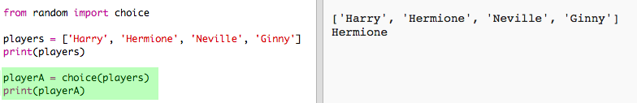
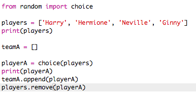
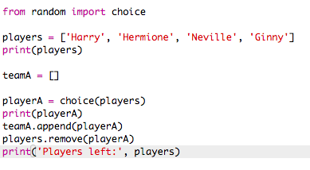

## बेतरतीब खिलाड़ी

चलो यादृच्छिक खिलाड़ियों का चयन करें!

+ अपने खिलाड़ियों की सूची से एक यादृच्छिक खिलाड़ी प्राप्त करने में सक्षम होने के लिए, सबसे पहले आपको यादृच्छिक मॉड्यूल के विकल्प हिस्से को आयात करने की आवश्यकता होगी।
    
    

+ एक यादृच्छिक खिलाड़ी प्राप्त करने के लिए, आप पसंद का उपयोग कर सकते हैं। (आप व्यक्तिगत खिलाड़ियों को प्रिंट करने के लिए कोड को भी हटा सकते हैं।) (आप व्यक्तिगत खिलाड़ियों को प्रिंट करने के लिए कोड भी हटा सकते हैं।)
    
    

+ कई बार अपनी पसंद कोड का परीक्षण करें और आपको हर बार एक अलग खिलाड़ी को चुना जाना चाहिए।

+ आप प्लेयर ए नामक एक नया वेरिएबल भी बना सकते हैं, और अपने यादृच्छिक खिलाड़ी को स्टोर करने के लिए इसका उपयोग कर सकते हैं।
    
    

+ टीम ए के सभी खिलाड़ियों को स्टोर करने के लिए एक नई सूची की आवश्यकता होगी । शुरू करने के लिए, यह सूची खाली होनी चाहिए।
    
    

+ अब आप टीम ए में अपने यादृच्छिक ढंग से चुने गए खिलाड़ी को जोड़ सकते हैं। ऐसा करने के लिए, आप teamA.append का उपयोग कर सकते हैं (परिशिष्ट का मतलब है अंत में जोड़ें)।
    
    

+ अब जब आपके खिलाड़ी को चुना गया है, तो आप उन्हें अपनी खिलाड़ियों की सूची से हटा सकते हैं।
    
    

+ एक प्रिंट कमांड जोड़कर इस कोड का परीक्षण करें, बचे हुए खिलाड़ियों में से चुनने के लिए
    
    
    
    ऊपर दिए गए उदाहरण में,हर्मिएक को ` teamA` के लिए चु ना गया है, और इसलिए  खिलाड़ियों की सूची से हटा दिया गया है < /0>।
</li>
</ul>