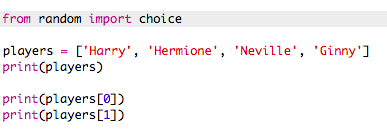

## अनियमित खिलाड़ी

चलो अनियमित खिलाड़ियों का चयन करें!

+ अपने `खिलाड़ियों` की सूची से एक अनियमित खिलाड़ी प्राप्त करने में सक्षम होने के लिए, सबसे पहले आपको `अनियमित` मॉड्यूल के `choice` हिस्से को आयात करने की आवश्यकता होगी।
    
    

+ एक अनियमित खिलाड़ी प्राप्त करने के लिए, आप `choice` का उपयोग कर सकते हैं। (आप व्यक्तिगत खिलाड़ियों को प्रिंट करने के लिए कोड भी हटा सकते हैं।)
    
    

+ कई बार अपनी `choice` कोड का परीक्षण करें और आपको हर बार एक अलग खिलाड़ी को चुना जाना चाहिए।

+ आप `playerA` नामक एक नया वेरिएबल भी बना सकते हैं, और अपने अनियमित खिलाड़ी को स्टोर करने के लिए इसका उपयोग कर सकते हैं।
    
    

+ Team A के सभी खिलाड़ियों को स्टोर करने के लिए एक नई सूची की आवश्यकता होगी । शुरू करने के लिए, यह सूची खाली होनी चाहिए।
    
    

+ अब आप `team A` में अपने अनियमित ढंग से चुने गए खिलाड़ी को जोड़ सकते हैं। ऐसा करने के लिए, आप `teamA.append` का उपयोग कर सकते हैं (**append** का मतलब है अंत में जोड़ें)।
    
    

+ अब जब आपके खिलाड़ी को चुना गया है, तो आप उन्हें अपनी `खिलाड़ियों` की सूची से हटा सकते हैं।
    
    

+ एक `print` कमांड जोड़कर इस कोड का परीक्षण करें, बचे हुए `players` में से चुनने के लिए |
    
    
    
    ऊपर दिए गए उदाहरण में,Hermoine को ` teamA` के लिए चु ना गया है, और इसलिए `players` की सूची से हटा दिया गया है।