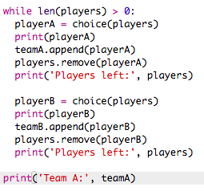

## बहुत से खिलाड़ी चुनना

इसके बाद आपको यह सुनिश्चित करना होगा कि हर खिलाड़ी को टीम के लिए चुना गया है।

+ टीम ए और टीम बी के लिए खिलाड़ियों को चुनने के लिए अपने कोड को हाइलाइट करें और कोड को इंडेंट करने के लिए टैब बटन दबाएं।
    
    

+ खिलाड़ियों की सूची की लंबाई 0 होने तक खिलाड़ियों को चुनने के लिए **while** लूप जोड़ें।
    
    

+ इसका परीक्षण करने के लिए अपना कोड चलाएं। आपको टीम ए और टीम बी के लिए चुने गए खिलाड़ियों को तब तक देखना चाहिए जब तक कि कोई और खिलाड़ी न बचे।
    
    

+ `while` लूप के बाद अपनी टीमए सूची को प्रिंट करने के लिए कोड जोड़ें (सुनिश्चित करें कि यह इंडेंटेड नहीं है)
    
    इसका मतलब है कि ` teamA ` केवल एक बार मुद्रित किया जाएगा, सभी खिलाड़ियों को चुने जाने के बाद।
    
    

+ आप ` teamB` के लिए भी ऐसा कर सकते हैं , और आप अन्य प्रिंट कमांड को भी हटा सकते हैं, क्योंकि वे केवल आपके कोड का परीक्षण करने के लिए थे।
    
    यहाँ दिखाया गया है कि आपका कोड कैसा दिखेगा:
    
    

+ अपने कोड का फिर से परीक्षण करें और आपको अपनी खिलाड़ियों की सूची के साथ-साथ अपनी अंतिम टीमों को भी देखना चाहिए।
    
    