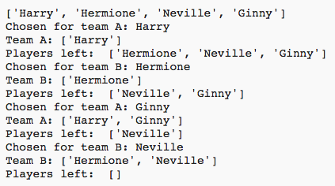

## बहुत से खिलाड़ी चुनना

इसके बाद आपको यह सुनिश्चित करना होगा कि प्रत्येक खिलाड़ी टीम के लिए चुना जाए।

+ टीम A और टीम B के लिए खिलाड़ी चुनने के लिए अपने कोड को हाइलाइट करें और कोड में स्थान छोड़ने के लिए टैब कुंजी दबाएँ।

	

+ तब तक खिलाड़ी चुनने के लिए __while__ लूप जोड़ें, जब तक `players` सूची की लंबाई 0 न हो जाए।

	

+ परीक्षण करने के लिए अपने कोड को रन करें। आपको देखना चाहिए कि टीम A और टीम B के लिए तब तक खिलाड़ी चुने जाते हैं, जब तक कोई खिलाड़ी शेष नहीं बचता है।

	

+ अपने `while` लूप के__बाद__ `teamA` सूची को प्रिंट करने के लिए कोड जोड़ें (यह सुनिश्चित करें कि कोई जगह छोड़ी नहीं गई है)।

	इसका अर्थ है कि `teamA` को सभी खिलाड़ी चुनने के बाद केवल एक बार प्रिंट किया जाएगा।

	

+ आप `teamB` के लिए भी ऐसा कर सकते हैं, और आप प्रिंट की अन्य कमांड्स को डिलीट भी कर सकते हैं, क्योंकि वे केवल आपके कोड का परीक्षण करने के लिए थीं।

	आपका कोड कुछ इस प्रकार दिखाई देना चाहिए:

	

+ अपने कोड का पुनः परीक्षण करें और आपको खिलाड़ियों और निर्णायक टीमों की सूची देखनी चाहिए।

	

