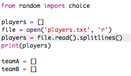

## फ़ाइलें

आप अपने खिलाड़ियों की सूची को संग्रहीत करने के लिए एक फ़ाइल का उपयोग कर सकते हैं।

+ + आइकन पर क्लिक करें और ` players.txt` नामक एक नई फाइल बनाएं ।
    
    

+ अपनी नई फ़ाइल में अपने खिलाड़ियों को जोड़ें। सुनिश्चित करें कि आपके अंतिम खिलाड़ी के बाद कोई खाली लाइन नहीं है।
    
    

+ अपने `players` की सूची बदलें ताकि यह खाली हो।
    
    

+ अपनी ` players.txt` फाइल खोलें (`'r'` का मतलब है केवल पढ़ने वाला फाइल) ।
    
    

+ फ़ाइल से सूची पढ़ें और अपने `players` की सूची में जोड़ें। (`splitlines` कोड का मतलब है कि फाइल में हर लाइन `players` लिस्ट में एक नया आइटम है ।
    
    

+ यदि आप अपने कोड का परीक्षण करते हैं, तो यह पहले की तरह ही काम करना चाहिए। हालांकि, अब अपने `players.txt` फ़ाइल में खिलाड़ियों को जोड़ना बहुत आसान है।