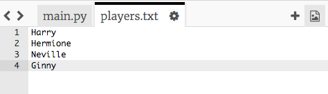

## फाइलें

आप अपने खिलाड़ियों की सूची को स्टोर करने के लिए फाइल का उपयोग कर सकते हैं।

+ + आइकन पर क्लिक करें और `players.txt` नामक नई फाइल बनाएँ।

	

+ अपनी नई फाइल में अपने खिलाड़ी जोड़ें। यह सुनिश्चित करें कि अंतिम खिलाड़ी के बाद कोई खाली पंक्ति शेष नहीं बचती है।

	

+ अपनी `players` सूची में परिवर्तन करें, ताकि यह खाली हो जाए।

	

+ अपनी `players.txt` फाइल खोलें (`'r'` का अर्थ रीड-ऑनली है)।

	

+ फाइल में से सूची को पढ़ें और अपनी `players` सूची में जोड़ें। (`splitlines` कोड का अर्थ है कि फाइल में प्रत्येक पंक्ति `players` सूची में नया आइटम होती है)।

	

+ यदि आप अपने कोड का परीक्षण करते हैं, तो यह पहले की तरह ही काम करेगा। हालाँकि, अब आपकी `players.txt` फाइल में खिलाड़ी जोड़ना बहुत ही आसान है।

