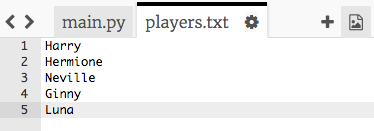
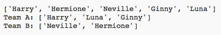

## विषम खिलाड़ी

खिलाड़ियों की विषम संख्या के साथ काम करने के लिए अपने कार्यक्रम में सुधार करें।

+ अपने `players.txt` में एक और नाम जोड़ें सूची, ताकि आपके पास विषम संख्या में खिलाड़ी हों।
    
    

+ यदि आप अपने कोड का परीक्षण करते हैं, तो आप देखेंगे कि आपको एक त्रुटि संदेश मिलेगा।
    
    

+ त्रुटि इसलिए है क्योंकि आपका प्रोग्राम टीम ए और फिर टीम बी के लिए यादृच्छिक खिलाड़ियों का चयन करता रहता है। हालांकि, अगर खिलाड़ियों की एक विषम संख्या है, तो टीम ए के लिए खिलाड़ी चुनने के बाद टीम बी के लिए चुनने के लिए कोई खिलाड़ी नहीं बचे हैं।
    
    इस बग को ठीक करने के लिए, आप अपने प्रोग्राम को `while` लूप से `ब्रेक` कर सकते हैं यदि आपके `खिलाड़ियों` की सूची खाली है।
    
    

+ यदि आप अपने कोड का फिर से परीक्षण करते हैं, तो आप देखेंगे कि यह अब खिलाड़ियों की विषम संख्या के साथ काम कर रहा है।
    
    