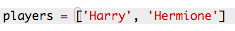

## Igrači

Započnimo sa kreiranjem popisa igrača koji će biti u timovima.

+ Otvori prazan Python predložak u Trinketu: <a href="http://jumpto.cc/python-new" target="_blank">jumpto.cc/python-new</a>.

+ **Listu** igrača možeš spremiti u varijablu. Lista se mora nalaziti unutar uglatih zagrada `[ ]`, a elemente liste potrebno je odvojiti zarezom.
    
    Započni s dodavanjem liste igrača u svoj program.
    
    

+ Dodaj sljedeći kôd za ispisivanje varijable `igraci`:
    
    

+ Do elementa u listi možeš doći upisivanjem njegove pozicije unutar uglatih zagrada nakon imena varijable.
    
    Prvi element liste ima **poziciju 0**. To se razlikuje od Scratcha gdje prvi element ima poziciju 1.
    
    