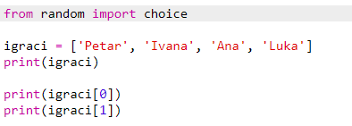
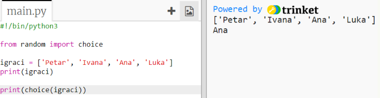
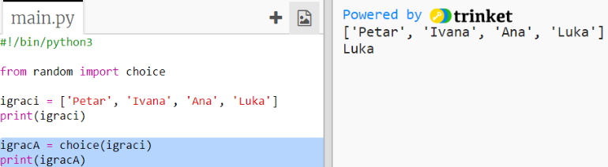
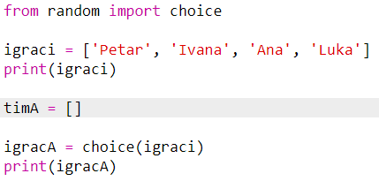
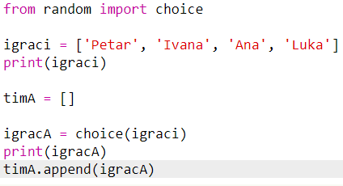
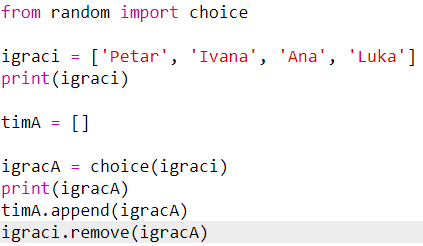
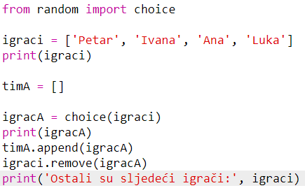

## Nasumični igrači

Odaberimo sada nasumično igrače timova!

+ Kako bi nasumično odabrali igrača iz liste `igraci`, prvo je potrebno uvesti naredbu `choice` iz modula `random`.
    
    

+ Koristi `choice` da bi dobio nasumičnog igrača. (Možeš i obrisati kôd koji ispisuje pojedinačne igrače.)
    
    

+ Isprobaj svoj `choice` kôd nekoliko puta i vidjet ćeš da je svaki put odabran drugi igrač.

+ Možeš kreirati novu varijablu imena `igracA` u koju ćeš spremiti nasumičnog igrača.
    
    

+ Za spremanje svih igrača iz tima A, moraš napraviti novu listu. Za početak, ova lista mora biti prazna.
    
    

+ Sada možeš dodati nasumično odabranog igrača u `tim A`. To češ napraviti koristeći `timA.append`(**append** znači dodati na kraj).
    
    

+ Sada je igrač izabran i možeš ga maknuti sa liste `igraci`.
    
    

+ Testiraj kôd dodavanjem naredbe `print` i provjeri koji su ti `igraci` preostali.
    
    
    
    U primjeru iznad, Ivana je odabrana za `timA` i zato je više nema na listi `igraci`.