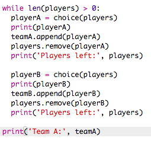

## Odabir više igrača

Sada se moraš pobrinuti da je svaki igrač u nekom od timova.

+ Označi dio kôda kojim se odabiru igrači za tim A i tim B i pritisni tipku tabulatora kako bi uvukao taj dio kôda.
    
    

+ Dodaj **while** petlju kako bi program birao igrače sve dok duljina liste `igraci` ne bude jednaka 0.
    
    

+ Pokreni i testiraj projekt. Igrači bi se trebali dodavati timu A i timu B sve dok više ne ostane nijedan igrač.
    
    

+ Dodaj kôd koji će ispisivati listu `tima A` **nakon** `while` petlje (pazi da ne bude uvučen).
    
    Tako će se `timA` ispisati samo jednom, nakon što svi igrači tima budu odabrani.
    
    

+ Na isti način možeš formirati i `tim B`. Također, možeš obrisati ostale naredbe za ispis jer su ti one samo služile da testiraš kôd.
    
    Ovako bi tvoj kôd trebao izgledati:
    
    

+ Još jednom testiraj kôd i vidjet ćeš listu igrača i finalnu postavu svakog tima.
    
    