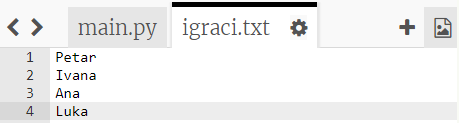
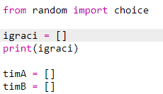
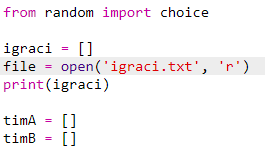
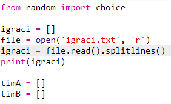

## Datoteke

Svoju listu igrača možeš spremiti u datoteku.

+ Klikni na znak + i kreiraj novu datoteku koju ćeš nazvati `igraci.txt`.
    
    

+ Dodaj svoje igrače u novu datoteku. Nemoj ostaviti praznu liniju nakon posljednjeg igrača.
    
    

+ Izmijeni listu `igraci` tako da bude prazna.
    
    

+ Otvori datoteku `igraci.txt` (slovo `'r'` označava da je datoteku moguće samo čitati).
    
    

+ Učitaj igrače iz datoteke i dodaj ih svojoj listi `igraci`. (Naredba `splitlines` u kôdu označava da je svaka linija u datoteci novi podatak u listi `igraci`).
    
    

+ Pokušaj testirati kôd - trebao bi raditi kao i prije. Ipak, sada je puno lakše dodati igrače u datoteku `igraci.txt`.