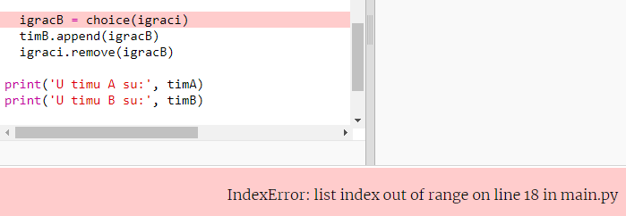
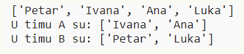

## Neparan broj igrača

Poboljšajmo program tako da može raditi i s neparnim brojem igrača.

+ Dodaj još jedno ime u svoju datoteku `igraci.txt` kako bi lista imala neparan broj igrača.
    
    

+ Ako testiraš kôd, dobit ćeš poruku o grešci.
    
    

+ Greška se javlja jer tvoj program prvo nasumično bira po jednog igrača za tim A, a zatim za tim B. S obzirom da je broj igrača sada neparan, kada se odabere igrač za tim A nema više igrača koje bi se moglo birati za tim B.
    
    Ovu grešku možeš popraviti ako kažeš programu da naredbom `break` izađe iz `while` petlje kada je lista `igraci` prazna.
    
    

+ Testiraj kôd opet i vidjet ćeš da program sada radi s neparnim brojem igrača.
    
    