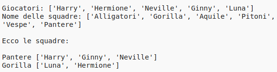

## Introduzione:

In questo progetto, imparerai come creare 2 squadre casuali da un elenco di giocatori.

  <iframe src="https://trinket.io/embed/python/a699c44ce6?outputOnly=true&start=result" width="600" height="500" frameborder="0" marginwidth="0" marginheight="0" allowfullscreen>
  </iframe>
  

### Ulteriori informazioni per gli organizzatori dei club

Se intendete stampare questo progetto, cliccate su [Versione stampabile](https://projects.raspberrypi.org/en/projects/team-chooser/print).

## \--- collapse \---

## title: Note per gli organizzatori del club

## Introduzione:

In questo progetto, i bambini impareranno come creare un programma per dividere un elenco di giocatori in 2 squadre casuali. Questo progetto insegna come usare liste e file di dati.

## Risorse online

**Questo progetto utilizza Python 3.** Consigliamo di utilizzare [trinket](https://trinket.io/) per scrivere in linguaggio Python online. Questo progetto contiene i seguenti Trinket:

* [Nuovo (vuoto) Trinket per Python -- jumpto.cc/python-new](http://jumpto.cc/python-new)

C'è anche un trinket che contiene il progetto completo:

* [‘Sorteggio dei gruppi’ finito -- trinket.io/python/a699c44ce6](https://trinket.io/python/a699c44ce6)

## Risorse offline

Questo progetto può anche essere [completato offline](https://www.codeclubprojects.org/en-GB/resources/python-working-offline/). È possibile accedere alle risorse del progetto facendo click sul link "Materiali del progetto" relativo a questo progetto. Alla sezione "Risorse del progetto" sono raccolte le risorse necessarie ai bambini per completare il progetto offline. È bene assicurarsi che tutti i ragazzi abbiano accesso a una copia di queste risorse. Questa sezione include i seguenti file:

* team/team.py

Potete anche trovare una versione completa di questo progetto nella sezione 'Risorse per i volontari', che contiene:

* team-finished/team.py

(Tutte le risorse sopracitate sono anche scaricabili come file progetto e volontario `.zip `.)

## Obiettivi di apprendimento

* Liste;
* Caricamento di liste di dati da un file.

This project covers elements from the following strands of the [Raspberry Pi Digital Making Curriculum](https://rpf.io/curriculum):

* [Utilizzo di costrutti base di un linguaggio di programmazione per creare programmi semplici.](https://www.raspberrypi.org/curriculum/programming/creator)

## Sfide

* "Aggiungere più giocatori" - aggiungere elementi ad una lista di `giocatori`;
* "Scegliere per il team B" - creazione di una nuova `squadraB` a cui aggiungere giocatori casuali;
* "Nomi casuali per i team": creazione e utilizzo di una lista di `nomi` per assegnare nomi casuali ai team;
* "Salvataggio dei nomi dei team": salvataggio dei nomi dei team in un file e caricamento in una variabile `teamNames`;
* "Più squadre": divisione dei giocatori in 3 squadre anziché 2.

\--- /collapse \---

## \--- collapse \---

## title: Materiali del progetto

## Risorse del progetto

* You can [find the resources for this project here](https://rpf.io/p/en/team-chooser-go){:target="_blank"}.
* [Trinket online vuoto per Python](http://jumpto.cc/python-new)
* [Trinket offline vuoto per Python](resources/new-new.py)

## Risorse per gli organizzatori del club

* You can [find the solutions for this project here](https://rpf.io/p/en/team-chooser-get){:target="_blank"}.
* [Trinket online completo](https://trinket.io/python/a699c44ce6)
* [team-chooser-finished/team-chooser.py](resources/team-chooser-finished-team-chooser.py)

\--- /collapse \---