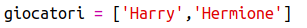
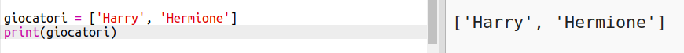
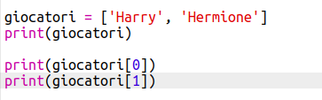

## Giocatori

Iniziamo creando una lista di giocatori dalla quale scegliere.

+ Apri il modello vuoto di Python Trinket: <a href="http://jumpto.cc/python-new" target="_blank">jumpto.cc/python-new</a>.

+ Puoi usare una variabile per salvare una_lista_di giocatori. La lista dovrebbe essere tra parentesi quadre `[ ]`, con una virgola tra ogni voce della lista.

	Aggiungiamo poi una lista di giocatori al tuo programma.

	

+ Aggiungi questo codice per stampare la tua variabile 'players':

	

+ Puoi raggiungere una voce della lista aggiungendo la sua posizione in parentesi quadre dopo il nome della variabile.

	La prima voce nella lista è alla_posizione 0_. Questa è diversa da Scratch, che inizia alla posizione 1.

	

