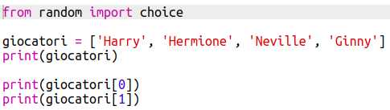
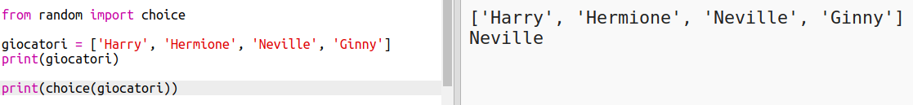
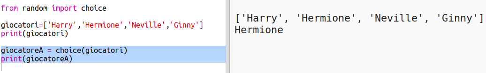
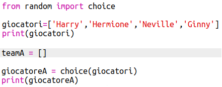
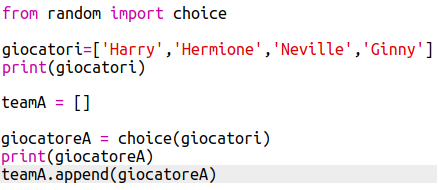
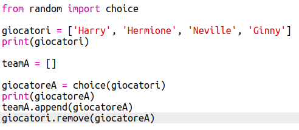
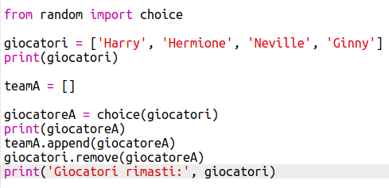

## Giocatori casuali

Scegliamo giocatori casuali!

+ Per essere in grado di ottenere un giocatore casuale dalla tua lista di `giocatori`, per prima cosa devi importare il metodo `choice` contenuto nel modulo `random`.
    
    

+ Per ottenere un giocatore casuale, puoi usare `choice`. (Puoi anche cancellare il codice per stampare i singoli giocatori.)
    
    

+ Metti alla prova il tuo codice `choice` alcune volte e dovresti verificare che ogni volta viene scelto un giocatore diverso.

+ Puoi anche creare una nuova variabile chiamata `playerA` e usarla per memorizzare il tuo giocatore casuale.
    
    

+ Avrai bisogno di una nuova lista per archiviare tutti i giocatori della squadra A. Per cominciare, questa lista deve essere vuota.
    
    

+ Ora puoi aggiungere il tuo giocatore scelto a caso al `teamA`. Per fare ciò, puoi usare `teamA.append` (**append** significa aggiungere alla fine).
    
    

+ Ora che il tuo giocatore è stato scelto, puoi rimuoverlo dalla tua lista di `giocatori`.
    
    

+ Prova questo codice aggiungendo un comando `print`, per mostrare i `giocatori` rimasti da scegliere.
    
    
    
    Nell'esempio sopra, Hermione è stata scelta per il `teamA`, e così è stata rimossa dalla lista dei `giocatori`.