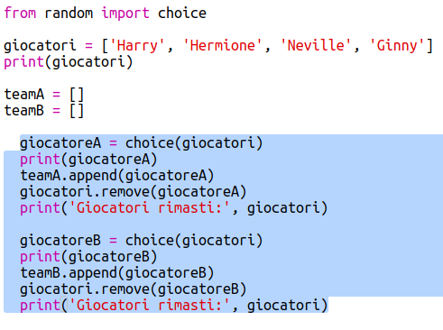
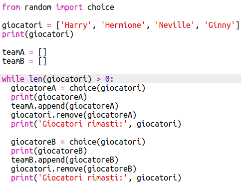
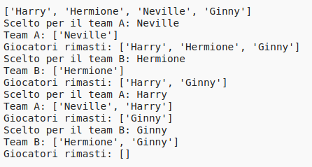
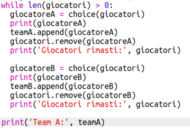
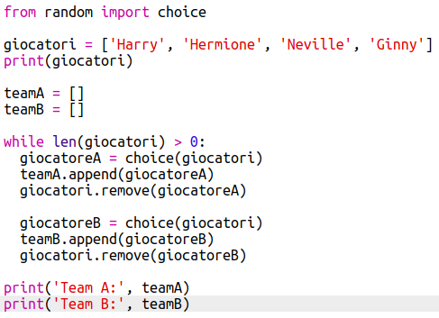

## Scegliere tanti giocatori

Dopo, dovrai assicurarti che ogni giocatore sia stato scelto per una squadra.

+ Evidenzia il tuo codice per scegliere i giocatori per la squadra A e la squadra B, e premi il tasto tab per indentare il codice.

	

+ Aggiungi un loop_while_per continuare a scegliere giocatori finché la lunghezza della lista di 'players' è 0.

	

+ Lancia il codice per vedere se funziona. Vedrai che verranno scelti giocatori per la squadra A e la squadra B finché non ne saranno rimasti più.

	

+ Aggiungi un codice per stampare la tua lista 'teamA'_dopo_il tuo loop 'while' (assicurandoti che non sia indentato).

	Questo significa che il 'teamA' verrà stampato solo una volta, dopo che sono stati scelti tutti i giocatori.

	

+ Puoi fare la stessa cosa per 'teamB' e puoi anche cancellare gli altri comandi di stampa, in quanto erano lì solo per provare il tuo codice.

	Il tuo codice dovrebbe apparire così:

	

+ Prova di nuovo il tuo codice e vedrai la tua lista di giocatori così come le squadre finali.

	

