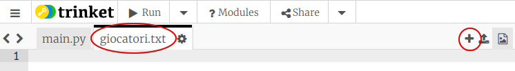
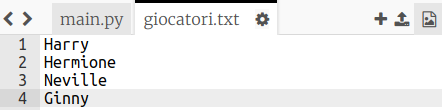
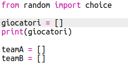
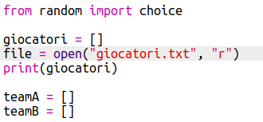
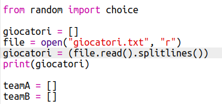

## File

Puoi usare un file per memorizzare la tua lista di giocatori.

+ Fai clic sull'icona + e crea un nuovo file chiamato `giocatori.txt`.
    
    

+ Aggiungi i tuoi giocatori al tuo nuovo file. Assicurati che non ci sia una riga vuota dopo il tuo ultimo giocatore.
    
    

+ Cambia la tua lista `giocatori` in modo che sia vuota.
    
    

+ Apri il tuo file `giocatori.txt ` (la lettera `'r'` significa in sola lettura).
    
    

+ Leggi la lista dal file e aggiungila alla tua lista `giocatori`. (Il codice `splitlines` significa che ogni riga nel file deve essere trattata come un nuovo elemento da inserire nella lista `giocatori`).
    
    

+ Se provi il tuo codice, dovrebbe funzionare esattamente come in precedenza. Tuttavia, ora è molto più semplice aggiungere giocatori al tuo file `giocatori.txt `.