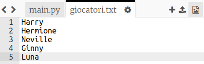
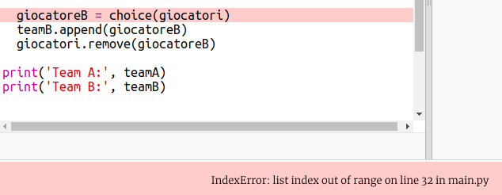
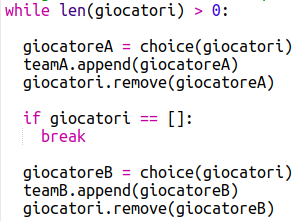

## Giocatori dispari

Miglioriamo il tuo programma per lavorare con un numero dispari di giocatori.

+ Aggiungi un altro nome alla tua lista `giocatori.txt`, in modo da avere un numero dispari di giocatori.
    
    

+ Se esegui il test del codice, vedrai che ricevi un messaggio di errore.
    
    

+ L'errore è dovuto al fatto che il tuo programma continua a scegliere giocatori casuali per la squadra A e poi la squadra B. Tuttavia, se c'è un numero dispari di giocatori, dopo aver scelto un giocatore per la squadra A non rimangono giocatori da scegliere per la squadra B.
    
    Per correggere questo bug, puoi dire al tuo programma di interrompere (`break`) il tuo ciclo `while` se la lista `giocatori` è vuota.
    
    

+ Se testi nuovamente il codice, dovreste vedere che ora funziona con un numero dispari di giocatori.
    
    