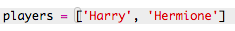

## プレイヤー

まず選ぶプレイヤーのリストを作成しましょう。

+ ブランクのPythonテンプレートを開き <a href="http://jumpto.cc/python-new" target="_blank">。Trinket： <a href="http://jumpto.cc/python-new" target="_blank"> jumpto.cc/python-new</a>。
</li> 
    
    <li>
      

        変数を使用して、プレーヤーの <strong>リスト</strong> を格納することができます。 リストは角括弧 <code>[]</code>で、リスト内の各項目の間にコンマを入れてください。
      

      

        あなたのプログラムに選手のリストを追加することから始めます。
      

      

        
      

    </li>
    
    <li>
      

        <code>人のプレーヤーを表示するにはこのコードを追加します</code> 変数：
      

      

        
      

    </li>
    
    <li>
      

        変数名の後に角カッコで囲んだ位置を追加して、リスト内の項目に移動することができます。
      

      

        リストの最初の項目は <strong>位置0</strong>ます。 これは位置1から始まるScratchとは異なります。
      

      

        
      

    </li></ul>