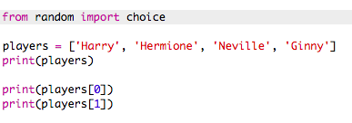

## ランダムプレイヤー

ランダムプレイヤーを選んでみましょう！

+ `人のプレイヤー` リストからランダムプレイヤーを得るには、まず `ランダム` モジュールのうちの `選択肢` をインポートする必要があります。
    
    

+ ランダムプレイヤーを取得するには、 `選択肢`使用します。 （個々のプレーヤーを印刷するコードを削除することもできます）。
    
    

+ `選択肢の` コードを数回テストし、毎回異なるプレーヤーが選択されるのを確認する必要があります。

+ あなたはとも呼ばれる新しい変数を作成することができます `playerA`、そしてあなたのランダムプレイヤーを保存するためにそれを使用します。
    
    

+ チームAのすべてのプレーヤーを保存するには、新しいリストが必要です。まず、このリストは空でなければなりません。
    
    

+ ランダムに選んだ選手を `チームに追加することができます`。 これを行うには、 `teamA.append` （**追加** は末尾に追加することを意味します）を使用できます。
    
    

+ あなたの選手が選出されたので、あなたは `人の選手のリストから選ぶことができます`。
    
    

+ このコードをテストするには、 `print` コマンドを追加して、選んだ `人のプレイヤー` を表示します。
    
    
    
    上記の例では、Hermioneが `チームA`ために選ばれたので、 `人のプレイヤーのリストから削除されました`。