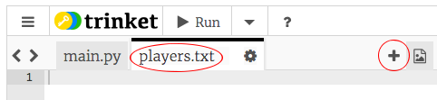

## ファイル

ファイルを使用して、選手のリストを保存することができます。

+ +アイコンをクリックしてと呼ばれる新しいファイルを作成します `players.txt`。
    
    

+ 新しいファイルにプレーヤーを追加します。 最後のプレーヤーの後に空白行がないことを確認してください。
    
    

+ `人のプレイヤー` リストを空になるように変更します。
    
    

+ `players.txt` ファイルを開きます（ `'r'` は読み取り専用です）。
    
    

+ ファイルからリストを読み、 `人のプレイヤーに` リストを追加します。 （ `スプリットライン` コードは、ファイル内のすべての行が `人のプレイヤー` リストの新しいアイテムであることを意味します）。
    
    

+ あなたのコードをテストするならば、前とまったく同じように動作するはずです。 ただし、 `players.txt` ファイルにプレーヤーを追加する方がはるかに簡単です。