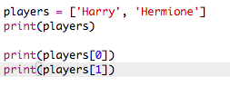

## ಆಟಗಾರರು

ಆಯ್ಕೆ ಮಾಡಲು ಆಟಗಾರರ ಪಟ್ಟಿಯನ್ನು ರಚಿಸುವ ಮೂಲಕ ಪ್ರಾರಂಭಿಸೋಣ.

+ ಖಾಲಿ ಪೈಥಾನ್ ಟೆಂಪ್ಲೆಟ್ Trinket: <a href="http://jumpto.cc/python-new" target="_blank">jumpto.cc/python-new </a>ಅನ್ನು ತೆರೆಯಿರಿ.

+ ನೀವು ಒಂದು ವೇರಿಯೇಬಲ್ ಅನ್ನು ಸಂಗ್ರಹಿಸಲು ಉಪಯೋಗಿಸಬಹುದು **list** ಆಟಗಾರರು. ಪಟ್ಟಿ ಚದರ ಆವರಣಗಳಲ್ಲಿರಬೇಕು `[ ]` , ಪಟ್ಟಿಯಲ್ಲಿರುವ ಪ್ರತಿಯೊಂದು ಐಟಂ ನಡುವೆ ಅಲ್ಪವಿರಾಮದಿಂದ.
    
    ನಿಮ್ಮ ಪ್ರೋಗ್ರಾಂಗೆ ಆಟಗಾರರ ಪಟ್ಟಿಯನ್ನು ಸೇರಿಸುವ ಮೂಲಕ ಪ್ರಾರಂಭಿಸಿ.
    
    

+ ನಿಮ್ಮ`players` ವೇರಿಯೇಬಲ್ ಅನ್ನು ಪ್ರಿಂಟ್ ಮಾಡಲು ಈ ಕೋಡ್ ಅನ್ನು ಹಾಕಿ:
    
    

+ ವೇರಿಯಬಲ್ ಹೆಸರಿನ ನಂತರ ಚದರ ಆವರಣಗಳಲ್ಲಿ ಅದರ ಸ್ಥಾನವನ್ನು ಸೇರಿಸುವ ಮೂಲಕ ನೀವು ಪಟ್ಟಿಯಲ್ಲಿರುವ ಐಟಂ ಅನ್ನು ಪಡೆಯಬಹುದು.
    
    ಪಟ್ಟಿಯಲ್ಲಿನ ಮೊದಲ ಐಟಂ **position 0** ರಲ್ಲಿದೆ. ಇದು ಸ್ಕ್ರ್ಯಾಚ್‌ಗೆ ಭಿನ್ನವಾಗಿದೆ, ಇದು ಸ್ಥಾನ ಒಂದರಿಂದ ಪ್ರಾರಂಭವಾಗುತ್ತದೆ.
    
    