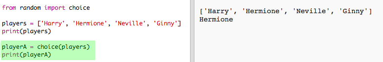
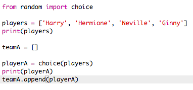
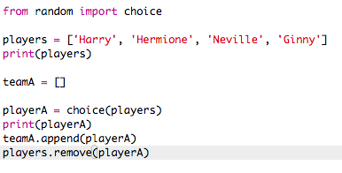
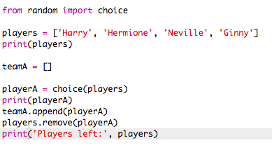

## ಸ್ವೇಚ್ಛೆಯಾದ ಆಟಗಾರರು

ಸ್ವೇಚ್ಛೆಯಾದ ಆಟಗಾರನನ್ನು ಆಯ್ಕೆ ಮಾಡೋಣ!

+ ಸ್ವೇಚ್ಛೆಯಾದ ಆಟಗಾರರನ್ನು ತರಲು ನಿಮ್ಮ `players` ಪಟ್ಟೆಇಂದ, ಮೊದಲು ನೀವು `choice` ಭಾಗವನ್ನು ಇಂಪೋರ್ಟ್ ಮಾಡಬೇಕು `ಸ್ವೇಚ್ಛೆಯಾದ` ಘಟಕ ಇಂದ.
    
    

+ ಸ್ವೇಚ್ಛೆಯಾದ ಆಟಗಾರರನ್ನು ತರಲು ನೀವು `choice`ಉಪಯೋಗಿಸಬಹುದು. (ನೀವು ಕೋಡ್ ಅನ್ನು ಸಹ ಅಳಿಸಬಹುದು ವಯಕ್ತಿಕ ಆಟಗಾರರನ್ನು ಮುದ್ರಿಸಲು.)
    
    

+ ಪರೀಕ್ಷಿಸಿ ನಿಮ್ಮ `choice` ಕೋಡ್ ಕೆಲವು ಬಾರಿ ಮತ್ತೆ ನೀವು ಕಾಣಬೇಕು ಪ್ರತಿಸಲ ಬೇರೆ ಆಟಗಾರರು ಆಯ್ಕೆ ಆಗುತ್ತಿರುವುದನ್ನು.

+ ನೀವು ಒಂದು ಹೊಸ ವೇರಿಯೇಬಲ್ ಅನ್ನು ತಯಾರಿಸಬಹುದು `playerA`, ಮತ್ತು ಅದನ್ನು ಉಪಯೋಗಿಸಬಹುದು ಸ್ವೇಚ್ಛೆಯಾದ ಆಟಗಾರನನ್ನು ಸಂಗ್ರಹಿಸಲು.
    
    

+ ಎ ತಂಡದಲ್ಲಿ ಎಲ್ಲ ಆಟಗಾರರನ್ನು ಸಂಗ್ರಹಿಸಲು ನಿಮಗೆ ಹೊಸ ಪಟ್ಟಿ ಅಗತ್ಯವಿದೆ. ಪ್ರಾರಂಭಿಸಲು, ಈ ಪಟ್ಟಿ ಖಾಲಿಯಾಗಿರಬೇಕು.
    
    

+ ನೀವು ಸ್ವೇಚ್ಛೆಯಾದ ಆಟಗಾರನನ್ನು ಸಹ ಸೇರಿಸಬಹುದು `teamA` ಗೆ. ಇದನ್ನು ಮಾಡಲು,ನೀವು ಉಪಯೋಗಿಸಬಹುದು `teamA.append` (**append** ಅಂದ್ರೆ ಕೊನೆಗೆ ಸೇರಿಸಿ ಯಂದು).
    
    

+ ಈಗ ನಿಮ್ಮ ಆಟಗಾರನನ್ನು ಆಯ್ಕೆ ಮಾಡಲಾಗಿರುವುದರಿಂದ, ನೀವು ಅವರನ್ನು ನಿಮ್ಮ `players` ಪಟ್ಟಿ ಇಂದ ತೆಗೆಯಬಹುದು.
    
    

+ ಪರೀಕ್ಷೆ ಮಾಡಿ ನಿಮ್ಮ ಕೋಡ್ ಅನ್ನು `print` ಕಮಾಂಡ್ ಅನ್ನು ಸೇರಿಸುವುದರ ಮೂಲಕ, ಉಳಿದಿದ್ದ `players` ಅನ್ನು ಆಯ್ಕೆ ಮಾಡಲು.
    
    
    
    ಮೇಲಿನ ಉದಾಹರಣೆ ಅಲ್ಲಿ, Hermione ಅನ್ನು `teamA` ಇಂದ ಆಯ್ಕೆ ಮಾಡಿದ್ದೇವೆ, ಮತ್ತು, `players` ಪಟ್ಟಿ ಇಂದ ತೆಗೆದಿದ್ದೇವೆ.