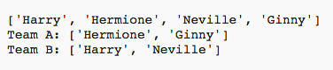

## ಸಾಕಷ್ಟು ಆಟಗಾರರನ್ನು ಆಯ್ಕೆ ಮಾಡುವುದು

ಮುಂದೆ ನೀವು ಪ್ರತಿ ಆಟಗಾರನನ್ನು ತಂಡಕ್ಕೆ ಆಯ್ಕೆ ಮಾಡಲಾಗಿದೆ ಎಂದು ಖಚಿತಪಡಿಸಿಕೊಳ್ಳಬೇಕು.

+ ತಂಡ ಎ ಮತ್ತು ತಂಡ ಬಿ ಗಾಗಿ ಆಟಗಾರರನ್ನು ಆಯ್ಕೆ ಮಾಡಲು ನಿಮ್ಮ ಕೋಡ್ ಅನ್ನು ಹೈಲೈಟ್ ಮಾಡಿ ಮತ್ತು ಕೋಡ್ ಇಂಡೆಂಟ್ ಮಾಡಲು ಟ್ಯಾಬ್ ಕೀಲಿಯನ್ನು ಒತ್ತಿ.
    
    

+ ಸೇರಿಸಿ ಒಂದು **while** ಲೂಪ್ ಆಟಗಾರರನ್ನು ಆಯ್ಕೆ ಮಾಡುತ್ತಿರಲು `players` ಉದ್ದ ಪಟ್ಟಿ ಅಲ್ಲಿ ಸೊನ್ನೆ ಆಗುವವರೆಗೂ.
    
    

+ ಅದನ್ನು ಪರೀಕ್ಷಿಸಲು ನಿಮ್ಮ ಕೋಡ್ ಅನ್ನು ಚಲಾಯಿಸಿ. ಹೆಚ್ಚಿನ ಆಟಗಾರರು ಉಳಿದಿಲ್ಲದವರೆಗೆ ಆಟಗಾರರನ್ನು ತಂಡ ಎ ಮತ್ತು ತಂಡ ಬಿ ಗೆ ಆಯ್ಕೆ ಮಾಡುವುದನ್ನು ನೀವು ನೋಡಬೇಕು.
    
    

+ ಕೋಡ್ ಅನ್ನು ಹಾಕಿ ಮುದ್ರಿಸಲು ನಿಮ್ಮ `teamA` ಪಟ್ಟಿ **after**ನಿಮ್ಮ `while` ಲೂಪ್(ಅದನ್ನು ಉದ್ದೇಶಿಸಿಲ್ಲ ಎಂದು ಖಚಿತಪಡಿಸಿಕೊಳ್ಳುವುದು).
    
    ಇದರರ್ಥ `teamA` ಎಲ್ಲಾ ಆಟಗಾರರನ್ನು ಆಯ್ಕೆ ಮಾಡಿದ ನಂತರ ಒಮ್ಮೆ ಮಾತ್ರ ಮುದ್ರಿಸಲಾಗುತ್ತದೆ.
    
    

+ ಇದಕ್ಕಾಗಿ ನೀವು ಅದೇ ರೀತಿ ಮಾಡಬಹುದು `teamB` ಗೋಸ್ಕರ, ನೀವು ಇತರ ಮುದ್ರಾ ಆಜ್ಞೆ ಗಳನ್ನೂ ಸಹ ಅಳಿಸಬಹುದು, ನಿಮ್ಮ ಕೋಡ್ ಅನ್ನು ಪರೀಕ್ಷೆ ಮಾಡಲು ಮಾತ್ರ ಅವರು ಇದ್ದರು.
    
    ನಿಮ್ಮ ಕೋಡ್ ಹೇಗೆ ಕಾಣಬೇಕು ಎಂಬುದು ಇಲ್ಲಿದೆ:
    
    

+ ನಿಮ್ಮ ಕೋಡ್ ಅನ್ನು ಮತ್ತೊಮ್ಮೆ ಪರೀಕ್ಷಿಸಿ ಮತ್ತು ನಿಮ್ಮ ಆಟಗಾರರ ಪಟ್ಟಿಯನ್ನು ಮತ್ತು ನಿಮ್ಮ ಅಂತಿಮ ತಂಡಗಳನ್ನು ನೀವು ನೋಡಬೇಕು.
    
    