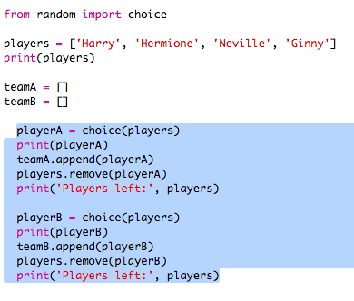
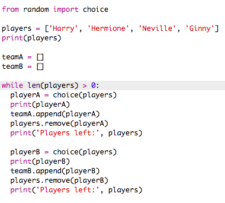

## ಸಾಕಷ್ಟು ಆಟಗಾರರನ್ನು ಆಯ್ಕೆ ಮಾಡುವುದು

ಮುಂದೆ ನೀವು ಪ್ರತಿ ಆಟಗಾರನನ್ನು ತಂಡಕ್ಕೆ ಆಯ್ಕೆ ಮಾಡಲಾಗಿದೆ ಎಂದು ಖಚಿತಪಡಿಸಿಕೊಳ್ಳಬೇಕು.

+ ತಂಡ ಎ ಮತ್ತು ತಂಡ ಬಿ ಗಾಗಿ ಆಟಗಾರರನ್ನು ಆಯ್ಕೆ ಮಾಡಲು ನಿಮ್ಮ ಕೋಡ್ ಅನ್ನು ಹೈಲೈಟ್ ಮಾಡಿ ಮತ್ತು ಕೋಡ್ ಇಂಡೆಂಟ್ ಮಾಡಲು ಟ್ಯಾಬ್ ಕೀಲಿಯನ್ನು ಒತ್ತಿ.
    
    

+ ಸೇರಿಸಿ ಒಂದು **while** ಲೂಪ್ ಆಟಗಾರರನ್ನು ಆಯ್ಕೆ ಮಾಡುತ್ತಿರಲು `players` ಉದ್ದ ಪಟ್ಟಿ ಅಲ್ಲಿ ಸೊನ್ನೆ ಆಗುವವರೆಗೂ.
    
    

+ ಅದನ್ನು ಪರೀಕ್ಷಿಸಲು ನಿಮ್ಮ ಕೋಡ್ ಅನ್ನು ಚಲಾಯಿಸಿ. You should see players being chosen for team A and team B until there are no more players left.
    
    

+ Add code to print your `teamA` list **after** your `while` loop (making sure it is not indented).
    
    This means that `teamA` will only be printed once, after all the players have been chosen.
    
    

+ You can do the same for `teamB`, and you can also delete the other print commands, as they were only there to test your code.
    
    Here's how your code should look:
    
    

+ Test your code again and you should just see your list of players as well as your final teams.
    
    