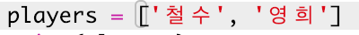
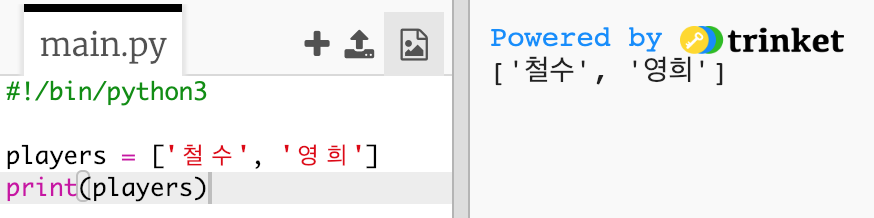
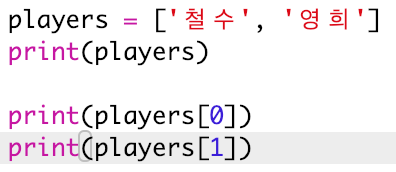

## 플레이어

먼저 선택할 플레이어 목록을 만들어 봅시다.

+ 빈 파이썬 템플릿 Trinket을 엽니다. <a href="http://jumpto.cc/python-new" target="_blank"> jumpto.cc/python-new</a>.

+ 변수를 사용하여 플레이어의 **리스트**를 저장할 수 있습니다. 목록은 대괄호 `[]`에 있어야하며 목록의 각 항목 사이에 쉼표가 있어야합니다.
    
    먼저 프로그램에 플레이어 목록을 추가하십시오.
    
    

+ 아래 코드로 `플레이어` 변수 내용을 출력하세요:
    
    

+ 변수 이름 뒤 대괄호를 추가하고, 대괄호 안에 위치를 추가하여 리스트의 항목을 가져올 수 있습니다.
    
    리스트의 첫 번째 항목의 **위치는 0에서 시작합니다.** 이는 1에서 위치가 시작하는 스크래치와 다르니 주의하시기 바랍니다.
    
    