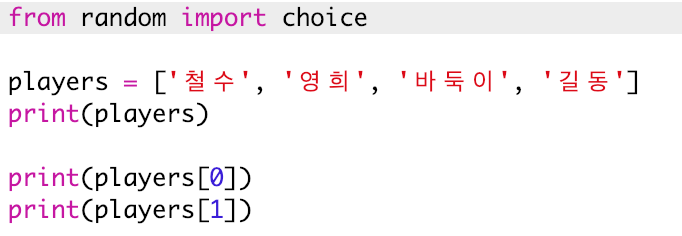
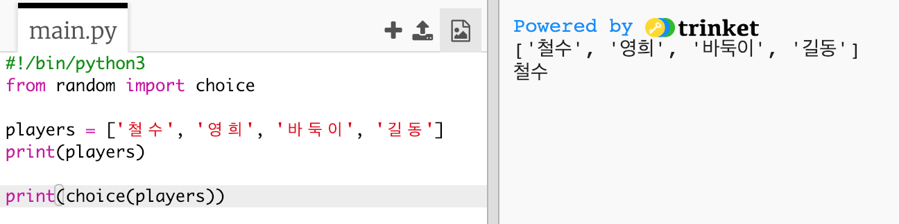
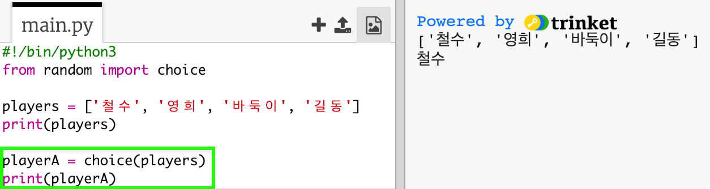
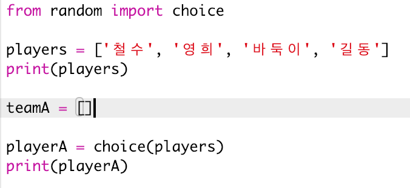
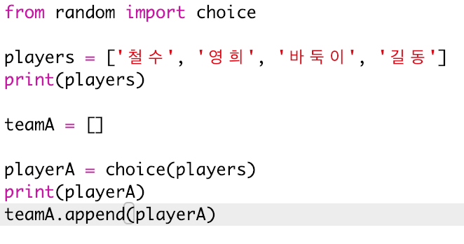
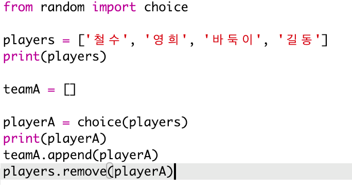
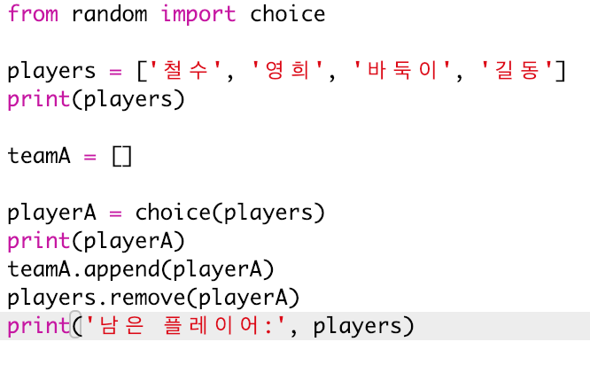

## 임의의 플레이어

플레이어를 임의로 선택해 봅시다.

+ `players` 리스트에서 임의의 플레이어를 불러오기 위해서는, 먼저 `random` 모듈 중 `choice` 부분을 import로 불러와야 합니다.
    
    

+ 임의의 플레이어를 고르려면, `choice`를 사용하면 됩니다. (코드를 삭제하여 개별 플레이어를 인쇄할 수도 있습니다.)
    
    

+ `선택` 코드를 몇 번 테스트하여 매번 다른 플레이어가 선택되는지 확인해 보세요.

+ `playerA`라는 새 변수를 만들어 임의의 플레이어를 저장하는 데 사용할 수도 있습니다.
    
    

+ team A의 모든 플레이어를 저장하려면 새 리스트가 필요합니다. 시작하려면 이 리스트가 빈 상태여야 합니다.
    
    

+ 이제 임의로 선택한 플레이어를 `team A`에 추가할 수 있습니다. 이렇게 하기 위해서는 `teamA.append` (**append** 는 리스트 끝에 항목을 추가하는 함수)를 사용할 수 있습니다.
    
    

+ 플레이어가 선택되었다면, `players` 리스트에서 해당 플레이어를 제거할 수 있습니다.
    
    

+ `print` 명령어를 `players`가 출력되도록 작성하여 여러분의 코드를 테스트해 보세요.
    
    
    
    위의 예시 그림에서 철수는 `teamA` 에 배정되어 `players` 목록에서 제거되었음을 확인할 수 있습니다.