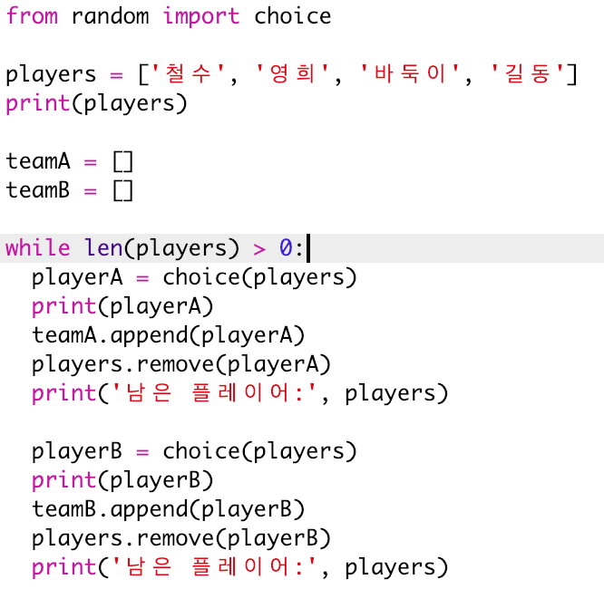
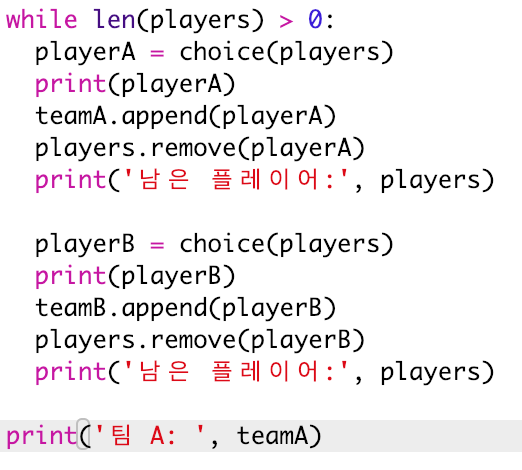
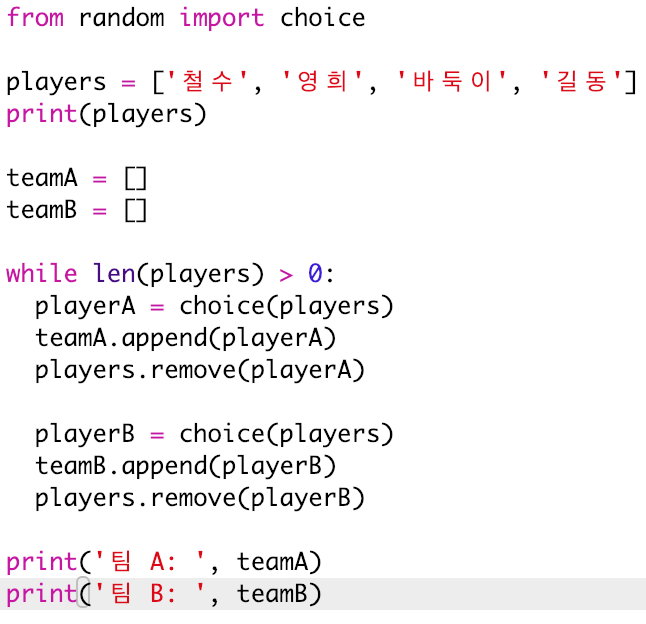
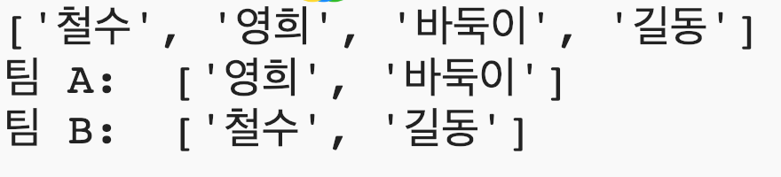

## 많은 플레이어 선택

다음으로 모든 플레이어가 각 팀에 배정되었는지 확인해야 합니다.

+ 팀 A와 팀 B의 플레이어를 고르는 코드를 선택하고 Tab 키를 눌러 코드를 들여 씁니다.
    
    

+ **while** 루프를 추가하여 `players` 리스트의 길이가 0이 될 때까지 플레이어를 계속 선택하도록 합니다.
    
    

+ 코드를 실행하여 테스트하십시오. 더 이상 플레이어가 남아 있지 않을 때까지 A 팀과 B 팀의 플레이어를 배정해야 합니다.
    
    

+ `while`문 **이후** `teamA` 리스트를 출력하는 코드를 추가합니다 (들여 쓰지 않았는지 확인하세요).
    
    즉, `teamA` 리스트는 모든 플레이어의 팀을 배정한 후 한번만 출력됩니다.
    
    

+ `teamB`에 대해서도 동일한 작업을 수행 할 수 있습니다. 그리고 코드에 들어 있었던 다른 print문은 테스트 용도이니 삭제하셔도 됩니다.
    
    코드는 다음과 같이 설계되어야 합니다:
    
    

+ 코드를 다시 테스트하여 최종 팀 뿐만이 아니라 플레이어 목록도 볼 수 있습니다.
    
    