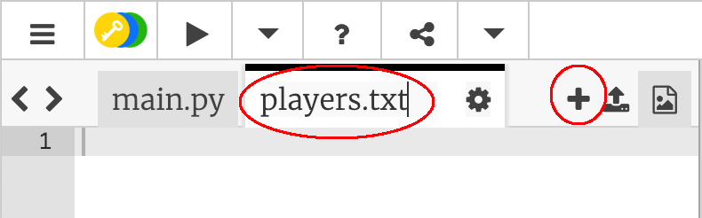

## 파일들

파일을 사용하여 플레이어 목록을 저장할 수 있습니다.

+ + 아이콘을 클릭하고 `players.txt`라는 새 파일을 만듭니다.
    
    

+ 새 파일에 플레이어를 추가합니다. 마지막 플레이어 뒤에 빈 내용이 없는지 확인하세요.
    
    

+ `players` 리스트를 비어 있게 만듭니다.
    
    

+ `players.txt` 파일을 엽니다. (`'r'`은 읽기 전용을 의미합니다).
    
    

+ 파일에서 리스트를 읽고 `players` 리스트에 플레이어를 추가합니다. (`splitlines` 코드는 파일의 각 라인이 `players` 리스트에 각각 삽입됨을 의미합니다.)
    
    

+ 코드를 테스트하면 이전과 똑같이 작동해야 합니다. 그러나 예전보다 `players.txt` 파일에 플레이어를 추가하는 것이 훨씬 쉬울 것입니다.