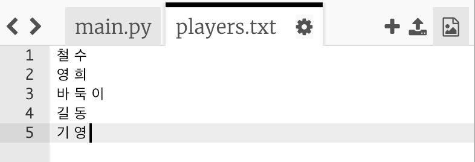
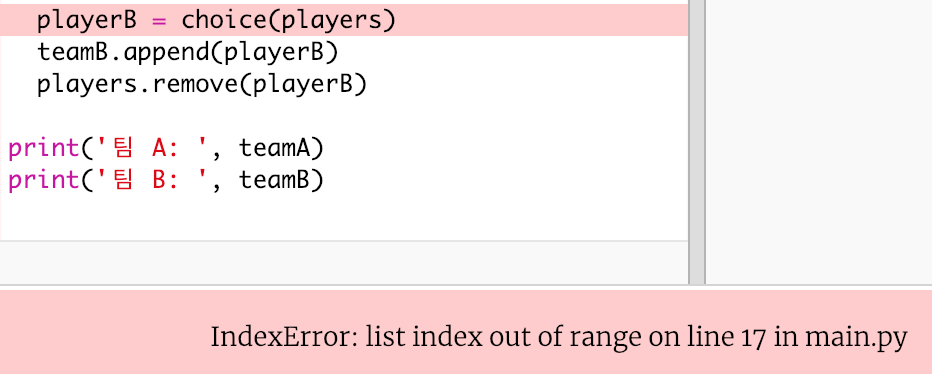
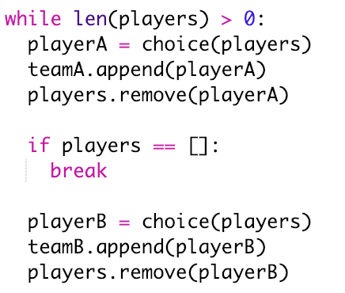
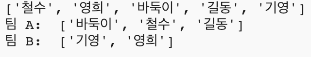

## 홀수 플레이어 취급하기

플레이어의 수가 홀수인 경우에도 처리할 수 있도록 프로그램을 개발해 봅시다.

+ `players.txt` 목록에 기영이를 추가하면 플레이어 수가 5명으로 홀수가 됩니다.
    
    

+ 코드를 테스트하면 아래와 같이 오류 메시지가 표시됩니다.
    
    

+ 팀 A와 팀 B에 대한 임의의 플레이어를 계속 배정하기 때문에 오류가 발생합니다. 코드의 흐름 상 플레이어의 명수가 홀수인 경우 팀 A의 플레이어를 선택한 후, 팀 B에 대해 선택할 수 있는 플레이어가 없기 때문에 에러가 발생하는 것입니다.
    
    이 버그를 해결하려면, `players` 리스트가 빈 경우, `break` 문으로 `while`문을 빠져나가도록 코드를 설계하면 됩니다.
    
    

+ 코드를 다시 테스트 해 보면, 홀수명의 플레이어에서 정상 작동하는 것을 볼 수 있습니다.
    
    