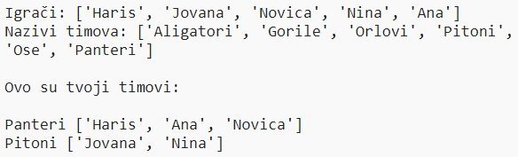

## Uvod:

U ovom projektu naučićeš kako da kreiraš dva nasumična tima koristeći imena sa liste igrača.

  <iframe src="https://trinket.io/embed/python/b88f01153f?outputOnly=true&start=result" width="600" height="500" frameborder="0" marginwidth="0" marginheight="0" allowfullscreen>
  </iframe>
  

### Dodatne informacije za vođe kluba

Ukoliko je potrebno da odštampate ovaj projekat, koristite [Verziju za štampu](https://projects.raspberrypi.org/me-ME/projects/team-chooser/print).

--- collapse ---
---
title: Bilješke za vođe kluba
---
## Uvod:

U ovom projektu djeca će naučiti kako da naprave program koji dijeli listu igrača na dva nasumična tima. U ovom projektu uči se izrada listi i korišćenje datoteka.

## Online izvori

**U ovom projektu koristi se Python 3.** Preporučujemo korišćenje [trinketa](https://trinket.io/) za online pisanje u Pythonu. Ovaj projekat sadrži sljedeće Trinkete:

* [Novi (prazan) Python Trinket -- jumpto.cc/python-new](http://jumpto.cc/python-new)

Takođe postoji trinket koji sadrži završen projekat:

* [Završen projekat 'Odaberi tim' -- trinket.io/python/b88f01153f](https://trinket.io/python/b88f01153f)

## Offline izvori

Ako želite, ovaj projekat može biti [izrađen offline](https://www.codeclubprojects.org/en-GB/resources/python-working-offline/). Izvorima projekta možete pristupiti klikom na link projekta 'Projektni materijali'. Navedeni link sadrži odjeljak 'Izvori projekta' u kojem se nalaze izvori koji će djeci biti potrebni kako bi izradila ovaj projekat offline. Obezbijedite da svako dijete ima pristup kopiji ovih izvora. Odjeljak sadrži sljedeće datoteke:

* team/team.py

Takođe, završenu verziju ovoga projekta možete naći u odjeljku 'Izvori za volontere' koji sadrži:

* team-finished/team.py

(Sve navedene izvore moguće je preuzeti kao `.zip` datoteke.)

## Ciljevi učenja

* Liste;
* Učitavanje podataka sa liste iz datoteke.

Ovim projektom obuhvaćeni su elementi iz sljedećih dijelova [Raspberry Pi Digital Making Curriculum](https://rpf.io/curriculum):

* [Koristite osnovne programske konstrukcije za kreiranje jednostavnih programa.](https://www.raspberrypi.org/curriculum/programming/creator)

## Izazovi

* ''Dodaj još igrača'' - dodavanje elemenata na listu `igraci`;
* ''Odaberi igrača za tim B'' - kreiranje nove liste `timB` na koju će biti dodati nasumično odabrani igrači;
* ''Nasumični nazivi timova'' - kreiranje i korišćenje nove liste `naziviTimova` za dodjeljivanje nasumično odabranih naziva timovima;
* ''Čuvanje naziva timova'' - smještanje naziva timova u datoteku i učitavanje naziva u promjenljivu `naziviTimova`;
* ''Više timova'' - podjela igrača u 3 tima, umjesto u 2.

--- /collapse ---

--- collapse ---
---
title: Projektni materijali
---
## Izvori projekta

* [.zip datoteka koja sadrži sve izvore projekta](resources/team-chooser-project-resources.zip)
* [Online prazan Python Trinket](http://jumpto.cc/python-new)
* [Offline prazna Python datoteka](resources/new-new.py)

## Izvori za vođe kluba

* [.zip datoteka koja sadrži sve završene izvore projekta](resources/team-chooser-volunteer-resources.zip)
* [Završen Trinket projekat online](https://trinket.io/python/b88f01153f)
* [team-chooser-finished/team-chooser.py](resources/team-chooser-finished-team-chooser.py)

--- /collapse ---