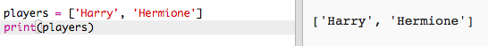

## Igrači

Počnimo sa kreiranjem liste igrača iz koje ćemo birati igrače za timove.

+ Otvori prazan Python šablon u Trinketu: <a href="http://jumpto.cc/python-new" target="_blank">jumpto.cc/python-new</a>.

+ **Listu** igrača možeš da smjestiš u promjenljivu. Lista mora da se nalazi unutar uglastih zagrada `[ ]`, a elementi liste treba da budu odvojeni zarezom.
    
    Počni sa dodavanjem liste igrača u svoj program.
    
    

+ Dodaj sljedeći kôd za ispisivanje promjenljive `igraci`:
    
    

+ Do elementa na listi možeš doći upisivanjem njegove pozicije unutar uglastih zagrada poslije naziva promjenljive.
    
    Prvi elemenat na listi ima **poziciju 0**. Razlikuje se od Scratcha, koji počinje od pozicije 1.
    
    