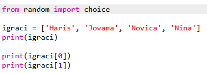
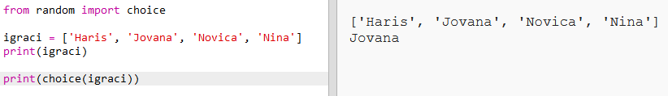
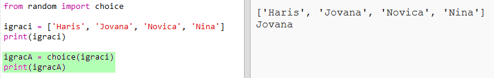
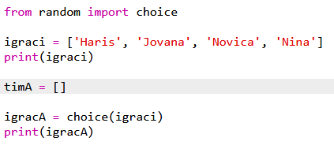
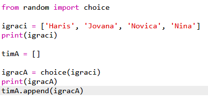
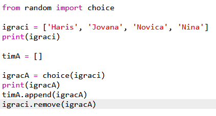
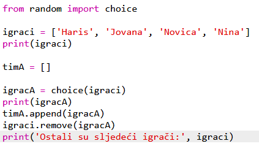

## Nasumični igrači

Odaberimo nasumično igrače timova!

+ Da bismo nasumično odabrali igrača iz tvoje liste `igraci`, prvo treba da uvezeš dio `choice` iz modula `random`.
    
    

+ Možeš koristiti `choice` da dobiješ nasumičnog igrača. (Možeš i da izbrišeš kôd koji ispisuje pojedinačne igrače.)
    
    

+ Isprobaj svoj `choice` kôd nekoliko puta i vidjećeš da je svaki put odabran drugi igrač.

+ Možeš i da kreiraš novu promjenljivu pod nazivom `igracA` u koju ćeš smjestiti svog nasumičnog igrača.
    
    

+ Biće ti potrebna nova lista da smjestiš sve igrače iz tima A. Ova lista na početku treba da bude prazna.
    
    

+ Sada možeš da dodaš svog nasumično odabranog igrača u `timA`. To možeš da napraviš koristeći `timA.append` (**append** znači dodati na kraj).
    
    

+ Sada kada je tvoj igrač odabran, možeš ga ukloniti sa svoje liste `igraci`.
    
    

+ Isprobaj ovaj kôd dodavanjem naredbe `print` kako bi bili prikazani `igraci` koji su preostali.
    
    
    
    U primjeru iznad, Jovana je odabrana za `timA` i zato je uklonjena sa liste `igraci`.