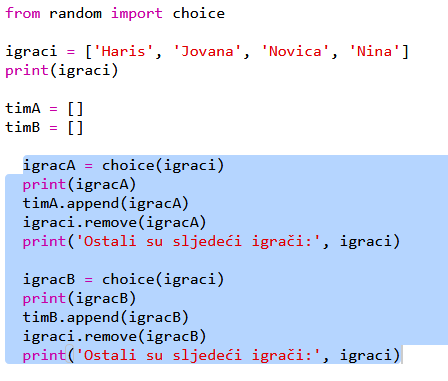
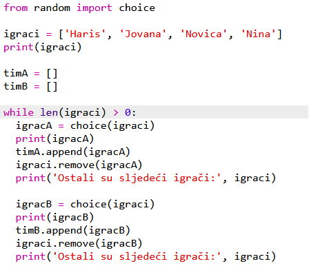
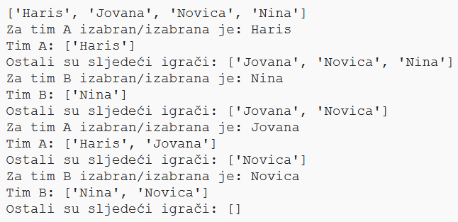
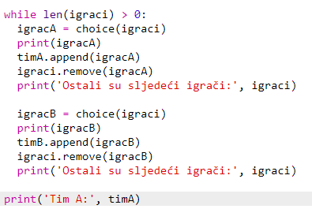
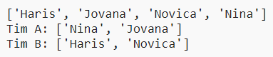

## Biranje više igrača

Sada treba da se pobrineš da je svaki igrač odabran za neki od timova.

+ Označi svoj kôd za biranje igrača za tim A i tim B i pritisni taster tabulatora da uvučeš kôd.
    
    

+ Dodaj petlju **while** kako bi igrači bili birani sve dok dužina liste `igrači` ne bude jednaka 0.
    
    

+ Pokreni svoj kôd da ga isprobaš. Trebalo bi da vidiš kako se igrači dodaju timu A ili timu B sve dok više ne bude nijednog igrača.
    
    

+ Dodaj kôd koji će ispisivati tvoju listu `timA` **poslije ** petlje `while` (pazi da ne bude uvučen).
    
    To znači da će `timA` biti ispisan samo jednom, nakon što svi igrači budu odabrani.
    
    

+ Možeš da uradiš isto za `timB`, a možeš i da izbrišeš ostale 'print' naredbe, pošto su one služile samo za isprobavanje tvog kôda.
    
    Ovako bi trebalo da izgleda tvoj kôd:
    
    

+ Još jednom isprobaj svoj kôd i vidjećeš svoju listu igrača, kao i konačne sastave timova.
    
    