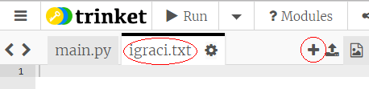
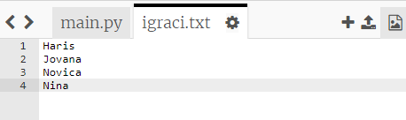
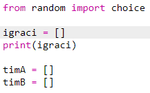
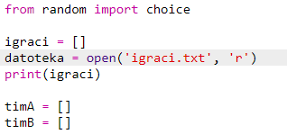
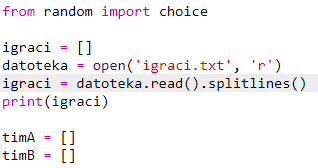

## Datoteke

Svoju listu igrača možeš smjestiti u datoteku.

+ Klikni na ikonu + i kreiraj novu datoteku koju ćeš nazvati `igraci.txt`.
    
    

+ Dodaj svoje igrače u novu datoteku. Nemoj ostaviti prazan red nakon posljednjeg igrača.
    
    

+ Izmijeni svoju listu `igraci` tako da bude prazna.
    
    

+ Otvori svoju datoteku `igraci.txt` (`'r'` znači read-only - da je datoteku moguće samo čitati).
    
    

+ Iščitaj listu iz datoteke i dodaj je u svoju listu `igraci`. (Kôd `splitlines` znači da je svaki red u datoteci novi elemenat u listi `igraci`).
    
    

+ Ako isprobaš svoj kôd, trebalo bi da funkcioniše isto kao i ranije. Ipak, sada je mnogo lakše dodati igrače u datoteku `igraci.txt`.