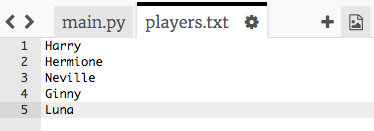

## Neparan broj igrača

Poboljšajmo tvoj program tako da može raditi sa neparnim brojem igrača.

+ Dodaj još jedno ime na svoju listu `igraci.txt` kako bi imao/imala neparan broj igrača.
    
    

+ Ako isprobaš svoj kôd, dobićeš poruku o grešci.
    
    

+ Greška se javlja zato što tvoj program i dalje bira nasumičnog igrača za tim A, a zatim za tim B. Međutim, ako je broj igrača neparan, onda nakon izbora igrača za tim A, nema više igrača koji bi mogli biti birani za tim B.
    
    Da popraviš ovu grešku, možeš da kažeš svom programu da naredbom `break` prekine `while` petlju ako je lista `igraci` prazna.
    
    

+ Ako ponovo isprobaš svoj kôd, vidjećeš da sada radi sa neparnim brojem igrača.
    
    