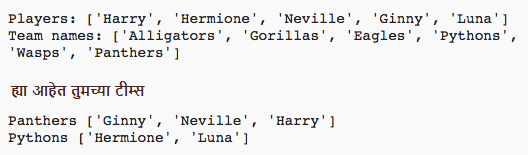

## परिचय:

ह्या प्रोजेक्ट मध्ये तुम्ही, खेळाडूंच्या यादीतून कोणत्याही 2 टीम्स कश्या तयार करायच्या ते शिकाल.

  <iframe src="https://trinket.io/embed/python/a699c44ce6?outputOnly=true&start=result" width="600" height="500" frameborder="0" marginwidth="0" marginheight="0" allowfullscreen>
  </iframe>
  

### क्लब प्रमुखांसाठी अधिक माहिती

जर तुम्हाला हे प्रोजेक्ट प्रिंट करायचे असेल, तर कृपया [प्रिंटर अनुकूल आवृत्ती](https://projects.raspberrypi.org/mr-IN/projects/team-chooser/print) वापरा.

--- collapse ---
---
title: क्लब प्रमुखांसाठी टिपा
---

## परिचय:

ह्या प्रोजेक्टमध्ये मुलं, एका खेळाडूंच्या यादी ला कोणत्याही 2 टिम्स मध्ये विभाजित करण्यासाठी प्रोग्राम कसा तयार करावा हे शिकतील. हे प्रोजेक्ट यादी आणि फाइल वापरणं शिकवते.

## ऑनलाइन संसाधने

**हे प्रोजेक्ट Python 3 वापरते** ऑनलाइन Python लिहिण्यासाठी आम्ही [trinket](https://trinket.io/) वापरण्याचा सल्ला देतो. ह्या प्रोजेक्ट मध्ये खलील Trinkets आहेत:

* [नवीन (रिकामं) Python Trinket -- jumpto.cc/python-new](http://jumpto.cc/python-new)

येथे पूर्ण झालेले प्रोजेक्ट असलेले एक trinket देखील आहे:

* ['टीम निवडकर्ता' पूर्ण झाले -- trinket.io/python/a699c44ce6](https://trinket.io/python/a699c44ce6)

## ऑफलाइन संसाधने

वाटल्यास हे प्रोजेक्ट [ऑफलाइन पूर्ण केलं जाऊ शकते](https://www.codeclubprojects.org/en-GB/resources/python-working-offline/). 'प्रोजेक्ट साहित्य'(Project Materials) ची लिंक क्लिक करून तुम्ही ह्या प्रोजेक्ट साठी संसाधने वापरू शकता. ह्या लिंक मध्ये एक 'प्रोजेक्ट संसाधने'(Project Resources)नामक विभाग आहे, ज्यामध्ये मुलांना हा प्रोजेक्ट ऑफलाइन पूर्ण करण्यासाठी लागणारी संसाधने आहेत. प्रत्येक मुलास ह्या संसाधंनांच्या प्रतिवार प्रवेश असल्याचे सुनिश्चित करा. या विभागात खालील फायली समाविष्ट आहेत:

* team/team.py

ह्या प्रोजेक्टची पूर्ण झालेली आवृत्ती तुम्हाला 'वॉलंटियर संसाधने' ('Volunteer Resources') विभागात मिळेल ज्यात हे आहे:

* team-finished/team.py

(वरील सर्व संसाधने प्रोजेक्ट आणि वॉलंटियर `.zip` फाइली म्हणून डाऊनलोड करण्यायोग्य देखील आहेत.)

## शिकण्याचे लक्ष्य

* याद्या;
* फाइलमधून यादी डेटा लोड करीत आहे.

ह्या प्रोजेक्ट मध्ये [Raspberry Pi Digital Making Curriculum](http://rpf.io/curriculum) च्या अभयासक्रमातील पुढील घटकांचा समावेश आहे:

* [सोपे प्रोग्राम तयार करण्यासाठी मूलभूत प्रोग्रामिंग रचना वापरा.](https://www.raspberrypi.org/curriculum/programming/creator)

## आव्हाने

* "आणखी खेळाडू जोडणे" - `players` यादी मध्ये घटक जोडणे;
* "टीम B साठी निवडणे" - यात कोणतेही खालडू जोडण्यासाठी एक नवीन यादी `teamB` तयार करणे;
* "कोणत्याही टीमची नावे" - टीम्स ला कोणतेही नावे नेमण्यासाठि एक नवीन यादी `teamNames` तयार करून वापरणे;
* "टीमची नावे संग्रहीत करणे" - टीमची नावे एका फाइल मध्ये संग्रहीत करणे, आणि त्यास एका `teamNames` चल(variable) मध्ये लोड करणे;
* "आणखी टीम्स" - खेळाडूंना 2 ऐवजी 3 टीम्स मध्ये विभाजित करणे.

--- /collapse ---

--- collapse ---
---
title: प्रोजेक्ट साहित्य
---

## प्रोजेक्ट संसाधने

* तुम्हाला [येथे ह्या प्रोजेक्ट ची संसाधने मिळतील](http://rpf.io/p/mr-IN/team-chooser-go){:target="_blank"}.
* [ऑनलाइन रिकामं Python Trinket](http://jumpto.cc/python-new)
* [ऑफलाइन रिकामी Python फाइल](resources/new-new.py)

## क्लब प्रमुख साठी संसाधने

* तुम्हाला [येथे प्रोजेक्ट चे उपाय मिळतील](http://rpf.io/p/mr-IN/team-chooser-get){:target="_blank"}.
* [ऑनलाइन पूर्ण झालेले Trinket प्रोजेक्ट](https://trinket.io/python/a699c44ce6)
* [team-chooser-finished/team-chooser.py](resources/team-chooser-finished-team-chooser.py)

--- /collapse ---