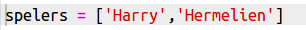
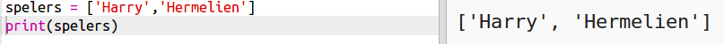
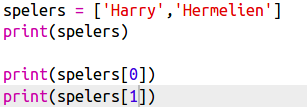

## Spelers

We beginnen met het maken van een lijst met spelers om uit te kiezen.

+ Open de lege Python-sjabloon Trinket: <a href="http://jumpto.cc/python-new" target="_blank">jumpto.cc/python-new</a>.

+ Je kunt een variabele gebruiken om een ​​ **lijst** van spelers in op te slaan. De lijst moet tussen vierkante haakjes `[ ]` staan, met een komma tussen elk item in de lijst.
    
    Begin met het toevoegen van een lijst met spelers aan het programma.
    
    

+ Voeg deze code toe om de `spelers` variabele weer te geven:
    
    

+ Je kunt een item uit de lijst kiezen door diens positie toe te voegen achter de naam van de variabele, tussen vierkante haken.
    
    Het eerste item in de lijst is op **positie 0**. Dat is anders dan bij Scratch, daar is de start op positie 1.
    
    