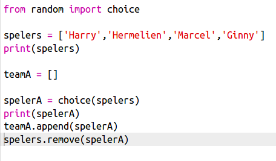
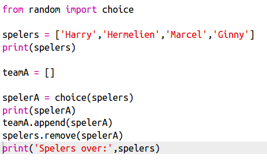

## Willekeurige spelers

We gaan spelers willekeurig kiezen

+ Om ​​een willekeurige speler uit je `spelers` lijst te krijgen, moet je eerst het `choice` deel van de `random` module importeren.
    
    

+ Om een ​​willekeurige speler te krijgen, kun je `choice` gebruiken. (Je kunt ook de code verwijderen om individuele spelers te laten zien)
    
    

+ Test een paar keer de `choice` code en je ziet dat er elke keer een andere speler wordt gekozen.

+ Je kunt ook een nieuwe variabele maken met de naam `spelerA` waar je de willekeurige speler in op kunt slaan.
    
    

+ Je hebt een nieuwe lijst nodig om alle spelers in team A op te slaan. Om te beginnen moet deze lijst leeg zijn.
    
    

+ Je kunt nu je willekeurig gekozen speler toevoegen aan `teamA`. Om dit te doen, kun je `teamA.append` gebruiken (**append** betekent aan het einde toevoegen).
    
    

+ Nu je speler is gekozen, kun je die verwijderen uit je lijst met `spelers`.
    
    

+ Test de code door een `print` opdracht toe te voegen die de `spelers` laat zien die nog over zijn.
    
    
    
    In het bovenstaande voorbeeld is Hermelien gekozen voor `teamA` en dus verwijderd uit de lijst met `spelers`.