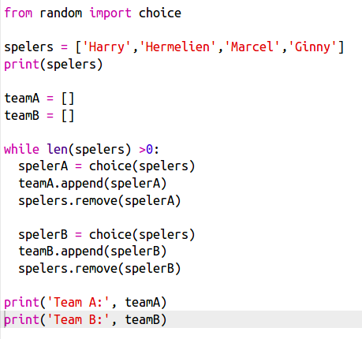

## Kies een aantal spelers

Vervolgens moet je ervoor zorgen dat elke speler voor een team is gekozen.

+ Selecteer de code voor het kiezen van spelers voor team A en team B en druk op de tabtoets om de code te laten inspringen.
    
    

+ Voeg een **while** lus toe om spelers te selecteren totdat de lengte van de `spelers` lijst 0 is.
    
    

+ Voer je code uit om te testen. Je zou moeten zien dat spelers worden gekozen voor team A en team B totdat er geen spelers meer over zijn.
    
    

+ Voeg code toe om je `teamA` lijst **na** de `while` lus te printen (zorg ervoor dat die niet inspringt).
    
    Dit betekent dat `teamA` slechts één keer zal worden weergegeven, nadat alle spelers zijn gekozen.
    
    

+ Je kunt hetzelfde voor `teamB` doen en de andere printopdrachten verwijderen, die waren er alleen om de code te testen.
    
    Zo zou de code eruit moeten zien:
    
    

+ Als je de code opnieuw test zou je alleen de spelerslijst en de definitieve teams moeten zien.
    
    