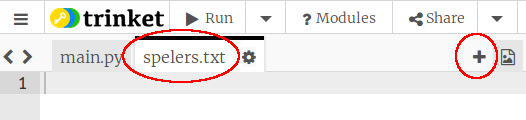
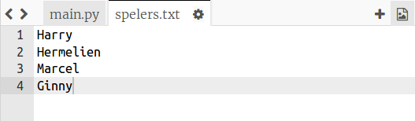
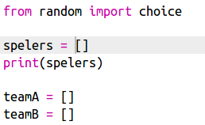
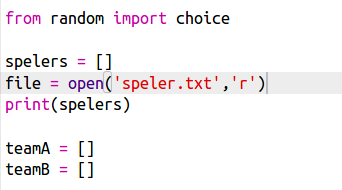
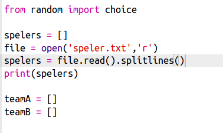

## Bestanden

Je kunt een bestand gebruiken om de lijst met spelers op te slaan.

+ Klik op het + -pictogram en maak een nieuw bestand met de naam `spelers.txt`.
    
    

+ Voeg spelers toe aan je nieuwe bestand. Zorg ervoor dat er geen lege regel is na de laatste speler.
    
    

+ Verander de `spelers` lijst zodat die leeg is.
    
    

+ Open het `spelers.txt` bestand (de `'r'` betekent alleen-lezen (Engels: read-only)).
    
    

+ Lees de lijst uit het bestand en voeg die toe aan je `spelers` lijst. (De `splitlines` (Nederlands: scheid regels) code betekent dat elke regel in het bestand een nieuw item is in de `spelers` lijst).
    
    

+ Als je de code test, zou die precies hetzelfde moeten doen als eerder. Maar het is nu veel gemakkelijker om spelers toe te voegen aan je `spelers.txt` bestand.