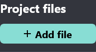

## Bestanden

Je kunt een bestand gebruiken om de lijst met spelers op te slaan.

\--- task \---

Click **Add file** and create a new file called `players.txt`.

\--- /task \---

\--- task \---

+ Voeg spelers toe aan je nieuwe bestand. Zorg ervoor dat er geen lege regel is na de laatste speler.

\--- /task \---

\--- task \---

Verander de `spelers` lijst zodat die leeg is.

## \--- code \---

language: python filename: main.py line_numbers: true line_number_start: 1

## line_highlights: 3

from random import choice

players = []

team_A = [] team_B = []

\--- /code \---

\--- /task \---

\--- task \---

Open het `spelers.txt` bestand (de `'r'` betekent alleen-lezen (Engels: read-only)).

## \--- code \---

language: python filename: main.py line_numbers: true line_number_start: 1

## line_highlights: 4

from random import choice

players = [] file = open('players.txt', 'r')

team_A = [] team_B = []

\--- /code \---

\--- /task \---

\--- task \---

Lees de lijst uit het bestand en voeg die toe aan je `spelers` lijst. (De `splitlines` (Nederlands: scheid regels) code betekent dat elke regel in het bestand een nieuw item is in de `spelers` lijst).

## \--- code \---

language: python filename: main.py line_numbers: true line_number_start: 1

## line_highlights: 5

from random import choice

players = [] file = open('players.txt', 'r') players = file.read().splitlines()

team_A = [] team_B = []

\--- /code \---

\--- /task \---

\--- task \---

Als je de code test, zou die precies hetzelfde moeten doen als eerder. Maar het is nu veel gemakkelijker om spelers toe te voegen aan je `spelers.txt` bestand.

\--- /task \---