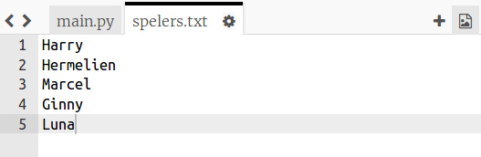
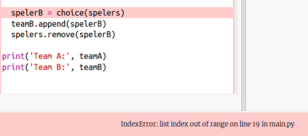
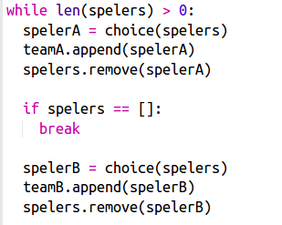
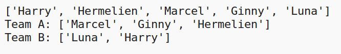

## Oneven aantal spelers

We gaan het programma verbeteren zodat we met een oneven aantal spelers kunnen werken.

+ Voeg een andere naam toe aan je `spelers.txt` lijst, zodat je een oneven aantal spelers hebt.
    
    

+ Als je de code test zie je een foutmelding.
    
    

+ De fout is dat je programma willekeurige spelers blijft kiezen voor team A en dan team B. Maar bij een oneven aantal spelers zijn er na het kiezen van een speler voor team A geen spelers meer over om uit te kiezen voor team B.
    
    Om deze bug te verhelpen, kun je met `break` uit de `while` lus komen als de `spelers` lijst leeg is.
    
    

+ Als je de code opnieuw test, zou je moeten zien dat die nu werkt met een oneven aantal spelers.
    
    