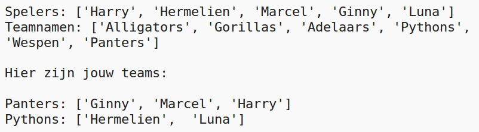

--- challenge ---

## Uitdaging: willekeurige teamnamen

Kun je beide teams een willekeurige teamnaam geven?

Je kunt een lijst maken met de naam `teamNamen` met daarin de namen waaruit kan worden gekozen.

Je kunt dan voor elk team een ​​willekeurige naam kiezen (en weergeven).

--- /challenge ---
***
### Door de community geleverde vertaling 

Dit project werd vertaald door **Henny van Ham**.

Onze geweldige vertalers helpen ons om kinderen over de hele wereld de kans te geven te leren coderen. Jij kunt ons helpen nog meer kinderen te bereiken door onze projecten te vertalen - lees meer op [rpf.io/translators](https://rpf.io/translators).
