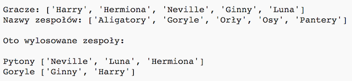

## Wprowadzenie

W tym projekcie nauczysz się tworzyć dwie losowe drużyny dobierając graczy z listy.

  <iframe src="https://trinket.io/embed/python/8638d150aa?outputOnly=true&start=result" width="100%" height="356" frameborder="0" marginwidth="0" marginheight="0" allowfullscreen>
  </iframe>
  

### Dodatkowe informacje dla liderów klubów

Jeśli chcesz wydrukować ten projekt, użyj [wersji do druku](https://projects.raspberrypi.org/en/projects/team-chooser/print).

--- collapse ---
---
title: Dla lidera klubu
---
## Wprowadzenie

W tym projekcie dzieci nauczą się, jak stworzyć program dzielący listę graczy na 2 losowe drużyny. Ten projekt uczy jak używać list i plików.

## Zasoby Online

**Ten projekt używa języka Python 3.** Do pisania kodu w Pythonie zalecamy użycie edytora [trinket](https://trinket.io/). Ten projekt zawiera następujące szablony:

* [Nowy (pusty) Python Trinket - jumpto.cc/python-new](http://jumpto.cc/python-new)

Dostępny jest też szablon zawierający ukończony projekt:

* [Ukończony projekt "Selekcjoner" - trinket.io/python/8638d150aa](https://trinket.io/python/8638d150aa)

## Zasoby Offline

Ten projekt można także [wykonać offline](https://www.codeclubprojects.org/en-GB/resources/python-working-offline/). Materiały potrzebne do wykonania projektu dostępne są po kliknięciu linku "Materiały do projektu". Można znaleźć tam sekcję "Źródła", która zawieraj zasoby, potrzebne dzieciom do wykonania projektu w wersji offline. Upewnij się, że każde dziecko ma dostęp do tych zasobów. Ta sekcja zawiera następujące pliki:

* team/team.py

Pełną wersję tego projektu można również znaleźć w sekcji "Zasoby dla wolontariuszy", która zawiera:

* team-finished/team.py

(Powyższe zasoby można również pobrać jako plik `.zip`.)

## Cele dydaktyczne

* Listy;
* Pobieranie danych do listy z pliku.

Projekt ten obejmuje następujące elementy [Cyfrowego programu nauczania Raspberry Pi](http://rpf.io/curriculum):

* [Użycie podstawowych konstrukcji programistycznych do tworzenia prostych programów.](https://www.raspberrypi.org/curriculum/programming/creator)

## Wyzwania

* "Dodawanie kolejnych graczy" - dodawanie elementów do listy `gracze`;
* "Wybieranie do zespołu B" - tworzenie nowej listy `zespolB` i dodawanie do niej losowych graczy;
* "Losowe nazwy zespołów" - tworzenie nowej listy `nazwyZespolow` i przydzielanie zespołom losowych nazw z tej listy;
* "Przechowywanie nazw zespołów" - przechowywanie nazw zespołów w pliku i zapisywanie ich w zmiennej `nazwyZespolow`;
* "Więcej zespołów" - dzielenie graczy na trzy drużyny zamiast dwóch.

--- /collapse ---

--- collapse ---
---
#title: Materiały do projektu
---
## Zasoby

* [Plik .zip zawierający wszystkie zasoby potrzebne do wykonania projektu](resources/team-chooser-project-resources.zip)
* [Pusty szablon Trinket do języka Python](http://jumpto.cc/python-new)
* [Plik z pustym szablonem do języka Python](resources/new-new.py)

## Zasoby dla lidera klubu

* [Plik .zip zawierający zasoby z ukończonym projektem](resources/team-chooser-volunteer-resources.zip)
* [Ukończony projekt "Selekcjoner"](https://trinket.io/python/8638d150aa)
* [team-chooser-finished/team-chooser.py](resources/team-chooser-finished-team-chooser.py)

--- /collapse ---